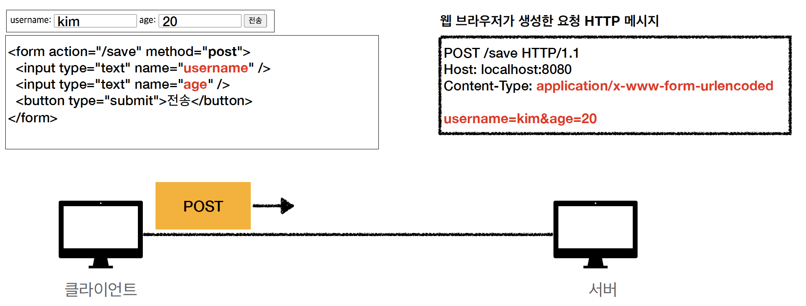

# 서블릿



이름과 나이를 입력해서 전송하면 회원 가입이 되는 폼을 전달한다고 가정해봅시다.

폼의 action은 /save에 전송되고, POST 메서드를 사용했다고 하자. 그러면 웹 브라우저가 HTTP 메세지를 다음과 같이 작성하고 username=kim%age=20으로 데이터를 전송하고, Content-type: application/xwww-form-urlencoded 이다.


비즈니스 로직은 HTTP 메세지를 풀어서 데이터를 받고 데이터베이스에 저장요청하는 것이 끝이다. 그래서 서블릿이라는게 나왔다.

서블릿이란 위에서 초록색을 제외한 모든 것을 다 알아서 해준다.

```java
@WebServlet(name = "helloServlet", urlPatterns = "/hello")
```

- urlPatterns의 URL이 호출되면 서블릿 코드가 실행된다.
- HTTP 요청정보를 편리하게 사용할 수 있는 HttpServletRequest를 다 만들어준다. 우리는 이 객체를 사용하기만 하면 된다.
- HTTP 응답 정보를 편리하게 제공할 수 있는 HttpServletResponse도 제공해준다. 개발자는 이 response 객체에 우리가 원하는 데이터를 넣으면 된다.
- 개발자가 HTTP 스펙을 매우 편리하게 사용할 수 있게 해준다.

HTTP의 기본적인 스펙을 알고 사용하면 좋겠지요~

## HTTP 요청, 응답 흐름


- 웹 브라우저에 요청하면 WAS 서버에서 요청 메세지를 기반으로 request, response 객체를 새로 만든다.
- request, response 매개변수를 넣어준 helloServlet이라는 것을 실행해준다.
- 응답 메세지 response를 웹 브라우저에 전달해준다.

### HTTP 요청시

- WAS는 Reqeust, Reseponse 객체를 새로 만들어서 서블릿 객체를 호출한다.
- 개발자가 request객체에서 HTTP 요청정보를 편리하게 꺼내서 사용할 수 있다.
- 개발자는 Response 객체에 HTTP 응답 정보를 편리하게 입력한다.
- WAS는 Response 객체에 담겨있는 내용으로 HTTP 응답 정보를 생성한다.

## 서블릿 컨테이너

서블릿 컨테이너를 직접 우리가 생성할 필요가 없다. WAS 안에는 서블릿 컨테이너가 있는데, 이 서블릿 컨테이너를 자동으로 생성, 호출, 관리해준다. WAS의 생명주기까지 다 관리해준다.

- 톰캣처럼 서블릿을 지원하는 WAS를 서블릿 컨테이너라고 한다.
- 서블릿 컨테이너는 서블릿 객체를 생성, 초기화, 호출, 종료하는 생명주기를 관리한다.
- 서블릿 객체는 **싱글톤으로 관리**된다.
    - 고객의 요청이 올때마다 계속 객체를 생성하는 것은 비효율적이다.
    - 최초 로딩시점에 하나를 만들어두고 재사용한다.
    - **공유 변수 사용에 주의해야한다.** →  멤버 변수를 잘못 세팅하면…끔찍
    - 서블릿 컨테이너 종료시 함께 종료된다.
- JSP도 서블릿으로 변환되어서 사용한다.
- **동시 요청을 위한 멀티쓰레드 처리를 지원한다.**