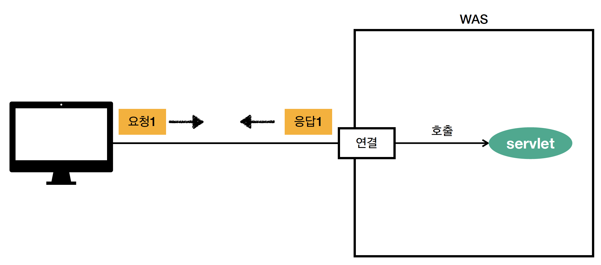

# 동시 요청 - 멀티 쓰레드

백엔드 개발자는 이 개념이 진짜 중요하다. 이걸 모르면 트래픽이 많을 때 대처하지 못하게 된다.

클라이언트가 요청하면 TCP/IP커넥션이 연결되고, 서블릿을 호출해준다. 그런데 이 서블릿이라는 것을 도대체 누가 호출해줄까? 바로 쓰레드가 호출한다.

## 쓰레드

- 애플리케이션 코드를 하나하나 순차적으로 실행하는 것을 쓰레드라고 한다.
- 쓰레드가 애플리케이션 코드를 순차적으로 실행한다.
- 자바의 main 메서드를 실행하면 main thread가 실행된다.
- 그래서 쓰레드가 없다면 자바 애플리케이션 실행이 불가능하다.
- 그리고 이 쓰레드는 한번에 하나의 코드라인만 수행한다.
- 그래서 동시 처리가 필요하다면 여러개의 쓰레드가 필요하다.

### 단일요청 - 쓰레드 하나 사용

요청이 오면 쓰레드를 할당해주고, 쓰레드가 서블릿을 호출해준다.

요청에 응답하고 나면 사용된 쓰레드는 휴식한다~~

### 다중요청 - 쓰레드 하나 사용

첫번째 요청이 서블릿을 요청하다가 처리가 지연되었다. 이럴 때 요청 2번이 들어왔다고 가정해보자. 그러면 쓰레드를 사용하기 위해서 요청2는 대기하게 된다. 이러면 두개의 요청이 둘다 죽는 문제가 발생한다.

따라서 요청이 올때 마다 쓰레드를 새로만들어서 서블릿을 사용하게 된다. 그리고 실행하고, 종료되면 쓰레드를 날리는 방법을 사용하게 된다. 우리가 개발하는 것은 아니고 WAS가 이렇게 처리해준다.

장점으로는

- 동시 요청을 처리할 수 있다.
- 리소스(CPU, 메모리)가 허용할 때까지 처리할 수 있다.
- 하나의 쓰레드가 지연되어도, 나머지 쓰레드는 정상동작한다.

단점으로는

- 쓰레드의 생성 비용이 비싸다
    - 고객 요청이 오 ㄹ때마다 쓰레드를 생성하면 응답속도가 늦어진다.
- 쓰레드는 Context Switching비용이 발생한다.
- 쓰레드 생성에 제한이 없다.
    - 고객 요청이 너무 많이 오면, CPU 메모리 임계점을 넘어서 서버가 죽을 수 있다.
    

## 쓰레드 풀

Pool 안에 쓰레드를 미리 만들어 두고 가져다쓴다. 다 사용하면 쓰레드 풀에 쓰레드를 반납한다.

이런방식을 사용하면 미리 사용할 최대의 쓰레드 갯수를 정해두었기 때문에 그 갯수 이상으로 요청이 오면 쓰레드를 대기시키거나 거절할 수 있다.

- 특징
    - 필요한 쓰레드를 쓰레드 풀에 보관하고 관리한다.
    - 쓰레드 풀에 생성가능한 쓰레드의 최대치를 관리한다. 톰캣은 최대 200개로 기본설정된다(변경가능)
- 사용
    - 쓰레드가 필요하면, 이미 생성되어 있는 쓰레드를 쓰레드 풀에서 꺼내서 사용한다.
    - 사용을 종료하면 쓰레드 풀에 해당 쓰레드를 반납한다.
    - 최대 쓰레드가 모두 사용중이여서 풀에 남아있는 쓰레드가 없으면 기다리는 요청은 거절하거나 특정숫자만큼 대기하도록 할 수 있다.
- 장점
    - 쓰레드가 미리 생성되어 있으므로 쓰레드를 새성하고 종료하는 비용이 절약되고, 응답시간이 빠르다.
    - 생성가능한 쓰레드의 최대치가 있으므로 너무 많은 요청이 들어와도 기존 요청은 안전하게 처리할 수 있다. → 인프라적으로 서버를 늘리긴 해야합니다.

### 실무 팁

- WAS의 주요 튜닝 포인트는 최대 쓰레드(max thread)수이다.
- 이 값을 너무 낮게 설정하면 동시요청이 많을 때 서버 리소스는 지연되지만 클라이언트는 금방 응답이 지연된다.
- 그렇다고 너무 높게 설정하면 CPU, 메모리 리소스 임계점 초과로 서버가 다운될 수 있다.
- 장애 발생시 클라우드면 일단 서버부터 늘리고, 이후에 튜닝한다. 클라우드가 아니라면 열심히 튜닝…

그래서의 쓰레드의 적정 숫자는 어떻게 찾을 수 있을까? 숫자로 딱 말하는건 틀렸다.

애플리케이션로직의 복잡도, CPU, 메모리, IO 리소스 상황에 따라 모두 다르다. 따라서 대략적으로 감을 잡아야한다. 중요한것은 결국 성능 테스트를 해봐야한다. 최대한 실제 서비스와 유사하게 성능테스트를 시도한다. 아파치 ab, 제이미터, nGrinder등을 사용한다.

## 정리

- 멀티쓰레드에 대한 부분은 WAS가 처리해준다.
- 개발자는 멀티 쓰레드 관련 코드를 신경쓰지 않아도 된다.
- 개발자는 마치 싱글 쓰레드 프로그래밍을 하듯이 편리하게 소스코드를 개발한다.
- 멀티 쓰레드 환경이므로 싱글톤 객체(서블릿, 싱글톤 빈)은 주의해서 사용하자!!