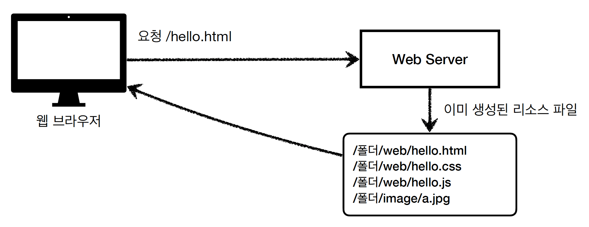

# HTML, HTTP API, CSR, SSR

이번에는 HTML, HTTP API, CSR, SSR등을 백엔드개발자가 어디까지 알아야하는지 알아보겠습니다.

## 정적리소스

정적리소스를 제공할 때는 보통 고정된 HTML파일, CSs, JS, 이미지 영상을 제공하면됩니다. /hello.html을 요청하게 되면 정해진 폴더에 있는 파일을 전달해주기만 하면됩니다.

### HTML 페이지

주문내역을 보여달라고 요청하면 WAS가 DB를 통해서 주문정보를 조회한 다음에 JSP, 타임리프 같은 뷰 템플릿을 사용해서 HTML을 동적으로 생성하고, 그 HTML을 웹브라우저에게 보내준다. 그럼 웹 브라우저는 html만 해설해서 보여주면 된다.

### HTTP API

HTML을 단순하게 전달하는 것이 아니라 **주로 JSON 형식**을 이용한 데이터를 보내주는 방식입니다. HTML로 렌더링 할 때 사용하는 것이 아니라 데이터만 주고 받고, UI 화면이 필요하면 클라이언트가 별도로 처리하게 된다. 

자바스크립트에서 필요한 정보를 제공하고 html을 동적으로 만드는 웹 클라이언트(React, Vue.js)에서 사용하거나, 아이폰 안드로이드와 같은 앱 클라이언트 그리고 서버와 서버끼리 데이터를 주고 받을 때 사용하게 됩니다. HTML을 서로 보여주는 곳을 제외한 모든곳에서 데이터를 주고받는데 사용됩니다.

### 백엔드 개발자가 고민해야 하는 점

- 정적 리소스를 어떻게 제공할 지
- 동적으로 제공되는 html 페이지를 어떻게 할지
- http api를 어떻게 제공할지

HTTP 방식으로 통신할 때는 이 세가지 방식을 고민하면 됩니다.

## 서버사이드 렌더링, 클라이언트사이드 렌더링

### SSR - 서버 사이드 렌더링

**서버에서 최종적으로 HTML을 다 만들어서 웹브라우저에게 응답**을 보내주고, 웹 브라우저는 HTML를 렌더링 해서 보여주는 방법. 동적으로 만들어진 최종 결과물이 서버에서 전부 만들어 진다고 해서 서버사이드 렌더링 이라고 합니다.

### CSR - 클라이언트 사이드 렌더링

클라이언트 사이드 렌더링이란 HTML 결과를 자바스크립트를 사용해서 웹 브라우저에서 동적으로 생성해서 적용하는 것을 말합니다. 주로 동적인 화면에서 주로 사용하고 웹 환경을 마치 앱 처럼 필요한 부분부분 변경할 수 있다.

관련기술에는 React, Vue.js가 있습니다 → 웹 프론트엔드 개발자

서버쪽에 요청을 하는점을 똑같다 하지만 클라이언트 사이드 렌더링의 경우에는

1. HTML을 요청하지만 HTML은 비어있고, 자바스크립트 링크를 보내준다.
2. 그래서 서버에 자바스크립트를 요청하고, 이 자바스크립트 코드에서는 클라이언트 로직과 HTML 렌더링 로직이 담겨있다.
3. HTTP API를 가지고 데이터를 요청하면 JSON으로 상품 데이터를 내려준다
4. 웹 브라우저가 자바스크립트의 클라이언트로직과 HTML 렌더링 로직을 사용해서 HTML을 동적으로 만들어서 보여준다.

하지만 SSR, CSR을 동시에 지원하는 웹 프레임워크도 있고, SSR을 사용하더라도 자바스크립트로 일부 동적으로 만드는 것도 가능하다. 딱딱 나누어져있는것은 없음.

## 그래서 어디까지 알아야하나?

백엔드 서버사이드 렌더링 기술은 JSP, 타임리프를 주로 사용한다. (타임리프를 스프링에서 민다고 한다.) 백엔드 개발자는 서버 사이드 렌더링 기술 학습이 필수이다.