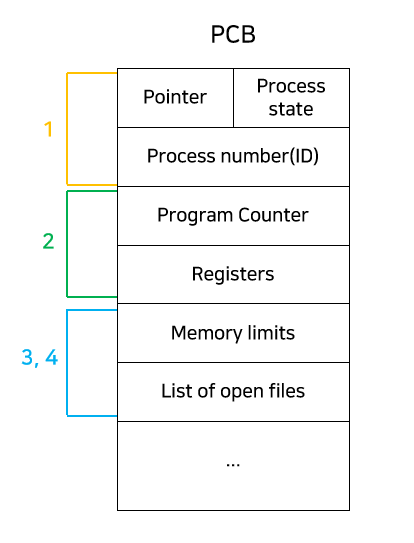

# 운영체제

[쉽게 배우는 운영체제](https://www.notion.so/88c7652551ee471da124c4dd51bb283d?pvs=21)

- **프로세스**
    
    프로세스란 메모리에 올라와서 실행되고 있는 작업의 단위를 말합니다. 
    
    - **프로세스 문맥(Process Context)에 대해서 설명해주세요**
        
        프로세스 문맥은 프로세스의 특정 시점의 상태를 말합니다. 하드웨어 컨텍스트로는 프로그램 카운터와 각종 레지스터가 있습니다. 이들을 활용해서 프로세스가 어디까지 실행되었는지 알 수 있습니다.
        
        프로세스의 주소공간, PCB, 프로세스 커널 스택도 프로세스 문맥에 포함됩니다.
        
    - **프로세스의 상태에 대해서 설명해주세요**
        - New: 프로세스가 처음생성된 상태 말합니다.
        - Ready: 프로세스가 CPU를 할당받기를 기다리는 상태
        - Running: 프로세스가 CPU를 할당받고 명령을 수행중인 상태
        - Waiting: 프로세스가 어떠한 이벤트가 발생하기를 기다리는 상태. CPU를 할당해도 당장 명령을 수행할 수 없는 상태입니다.
        - Terminated: 프로세스가 실행을 마친 상태입니다. 그래도 아직 완전히 프로세스가 제거된 상태는 아닙니다.
    - **PCB에 대해서 설명해주세요**
        
        
        
        PCB는 운영체제가 프로세스를 관리하기 위해 프로세스별로 가지고 있는 정보입니다.
        
        프로세스의 상태와 프로세스 아이디, 프로그램 카운터, 레지스터등의 정보를 담고 있습니다.
        
    - **PCB, Context Switching**
        - **PCB가 무엇인지 설명해주세요**
            
            PCB란 프로세스의 메타데이터를 담고 있는 자료구조이다.
            
        - **왜 PCB를 사용하나요?**
            
            프로세스가 여러 개일 때 프로세스를 스케줄링을 통해서 관리하게 되고 어떤 프로세스인지 알아야 관리가 가능합니다. 그래서 프로세스의 정보를 담고 있는 PCB가 필요합니다.
            
            또 CPU에서는 프로세스의 상태에 따라서 교체작업이 이루어집니다. 이때, 앞으로 다시 수행할 대기중인 프로세스의 정보를 저장할 장소가 필요하기 때문입니다.
            
        - **PCB는 어떻게 관리되나요?**
            
            PCB는 링크드 리스트 방식으로 관리됩니다. 새로운 프로세스가 생성될 때마다 PCB가 PCB List Head에 붙고, 프로세스가 종료되면 연결리스트에서 unlink되는 방식으로 관리됩니다.
            
        - **Context Switching이란 무엇인가요?**
            
            프로세스가 실행되다가 CPU를 다른 프로세스로 넘겨주는 과정을 말합니다. 운영체제가 CPU를 내어주는 프로세스의 상태를 PCB에 저장하고, CPU를 새롭게 얻어오는 프로세스의 상태를 PCB를 통해 읽어옵니다.
            
            - **인터럽트가 발생하면 항상 Context Switching이 일어나나요?**
                
                시스템 콜이나 인터럽트가 발생한다고 해서 무조건 Context Switching이 일어나는 것은 아닙니다. 다른 프로세스에 프로세서가 넘어가야 Context Switching 입니다. 인터럽트가 발생해도 기존에 수행하던 프로세스를 이어서 수행하는 경우도 있습니다.
                
        - **Context Switching은 언제 발생하나요?**
            
            Context Switching은 인터럽트가 발생하거나, CPU 사용시간을 모두 소모했거나, 입출력을 위해 대기해야 하는 경우 발생합니다.
            
    - **프로세스 Scheduling**
        - **멀티 프로그래밍의 목적이 무엇인가요?**
            
            CPU를 최대한 사용하기 위해서 몇몇 프로세스를 항상 실행시키는 것 입니다. 
            
        - **Time Sharing의 목적이 무엇인가요?**
            
            프로세스간에 CPU를 빠르게 전환해서 사용자가 각 프로그램이 실행되는 동안 서로 상호작용할 수 있도록 하는 것 입니다.
            
        - **프로세스 스케줄링이 무엇인가요?**
            
            프로세스 스케줄링이란 어떤 프로세스를 CPU에 할당할 것인지 결정하는 것을 말합니다.
            
        - **프로세스를 스케줄링하기 위한 세가지의 큐에 대해 설명해주세요**
            
            프로세스를 스케줄링 하기 위한 큐에는 Job Queue, Ready Queue, Device Queue가 있습니다. 
            
            - Job Queue는 하드디스크에 있는 프로그램이 실행되기 위해 메인 메모리의 할당을 기다리는 큐
            - Ready Queue는 현재 메모리 내에 있고, CPU를 할당받기를 기다리는 프로세스의 집합,
            - Device Queue는 Device I/O작업을 대기하고 있는 프로세스의 집합입니다.
        - **스케줄러의 종류, 장기, 중기, 단기 스케줄러에 대해 설명해주세요**
            
            
            
            사용할 수 있는 메모리는 한정되어 있는데 프로세스들이 한꺼번에 메모리에 올라올 경우 디스크에 임시로 저장됩니다. 장기스케줄러는 디스크에 있는 프로세스 중에서 어떤 프로세스를 Ready Queue로 보낼지 결정하는 스케줄러가 장기스케줄러 입니다. 디스크와 메모리 사이의 스케줄링을 담당하고 `실행중인 프로세스의 수를 제어한다는 점`이 특징입니다.
            
            단기 스케줄러는 메모리에 올라와 있는 프로세스 중 어떤 프로세스에게 CPU를 할당할지를 결정합니다. 메모리와 CPU사이의 스케줄링 담당하여 Ready Queue에 있는 프로세스중 어떤 프로세스에 CPU를 할당할지 결정합니다.
            
            중기 스케줄러는 여유공간의 마련을 위해 어떤 프로세스를 메모리에서 디스크로 swap out 할지 결정하는 스케줄러입니다. 시스템의 메모리에 너무 많은 프로그램이 올라오는 것을 제어하기 위해서 사용합니다. 이 스케줄러도 실행중인 프로세스의 수를 제어한다는 점이 특징입니다.
            
            - **`어떤 경우에 프로세스를 메모리에서 디스크로 swap out하나요?`**
                
                ready 상태에서 계속 CPU를 점유하지 못하거나 sleep 상태에서 ready 상태로 넘어가지 못하는 프로세스는 실행도 잘 되지 못하면서 메모리에서 자리만 차지하게 됩니다. 이때 세컨더리 스토리지로 swap out 됩니다.
                
            - **`New 상태에서도 suspended ready상태로 갈 수 있나요?`**
                
                원래는 메모리를 할당받아서 ready 상태가 되어야하는데 여러가지 문제로 인해서 메모리 할당을 받지 못하면 suspended ready 상태로 갈 수 있습니다.
                
        - **선점/비선점 스케줄링에 대해서 설명해주세요**
            - 선점(preemptive)은 `OS가 CPU의 사용권을 선점할 수 있는 경우`를 말합니다. 현재 수행하고 있는 작업이 있다고 하더라도 강제로 CPU를 회수할 수 있습니다.
            - 비선점(Non-Preemptive)는 프로세스가 종료되거나 I/O이벤트가 발생하기 전까지 실행을 보장하는 것을 의미합니다.
        - **프로세스의 suspended상태에 대해 설명해주세요**
            
            중기 스케줄러에 의해 프로세스가 메모리에서 디스크로 swap out되면 suspended 상태가 됩니다. 외부적인 이유로 프로세스의 수행이 정지된 상태를 말합니다. blocked된 상태는 Device의 I/O작업을 기다리는 상태이기 때문에 스스로 ready상태로 돌아갈 수 있지만 이 suspended 상태는 외부적인 이유로 중지되었기 때문에 스스로 돌아갈 수 없습니다.
            
        - **CPU 스케줄링 알고리즘에 대해 설명해주세요**
            
            Ready Queue에 있는 프로세스 중 어떤 프로세스에 CPU를 할당할지 결정하는 알고리즘을 말합니다. FCFS, SJF, SRTF, Priority-Scheduling, RR 등의 알고리즘이 있습니다.
            
            FCFS는 먼저 온 작업을 먼저 처리해주는 방식입니다. 소요시간이 긴 프로세스가 먼저 도달하게 되면 효율성이 낮아집니다.
            
            SJF는 다른 프로세스가 먼저 도착했어도 CPU사용시간이 짧은 프로세스에게 CPU를 우선적으로 할당하는 방법입니다.  효율성을 추구하긴 하지만 수행시간이 긴 프로세스의경우 우선순위가 계속 뒤로 밀려서 영원히 CPU를 할당받지 못할 수도 있는 starvation문제가 발생할 수도 있습니다.
            
            Priority Scheduling은 프로세스에 우선순위를 주고 우선순위가 높은 프로세스를 먼저 수행하는 것입니다. 이 또한 starvation문제가 발생할 수도있고, 이를 우선순위가 낮은 프로세스라도 기다리는 시간이 길어질수록 높은 우선순위를 주는 aging이라는 방식을 통해 해결할 수 있습니다.
            
            Round Robin은 interactive한 작업을 할 때 현대에 보편적으로 사용할 수 있는 방법입니다. 각 프로세스가 time quantum이라는 동일한 크기의 할당시간을 가지고 할당시간이 끝나면 다음 프로세스에게 CPU의 할당을 넘기게 됩니다.
            time quantum이 너무 길어지면 FCFS알고리즘과 다를바가 없어지고, 너무 짧으면 context switching이 너무 길어져 그만큼 오버헤드가 많이 소모됩니다.
            
        - **Reentrant에 대해 설명해주세요**
            
            어떤 함수가 Reentrant하다는 것은 여러 스레드가 동시에 접근해도 항상 같은 실행결과를 보장한다는 의미입니다. 
            
    - **Process Management**
        
        **`프로세스 생성`**
        
        - **자원 공유를 기준으로 프로세스의 특성을 분류해주세요**
            - 부모와 자식이 모든 자원을 공유하는 모델
            - 부모와 자식이 자원의 일부만 공유하는 모델
            - 전혀 공유하지않는 모델
            
            세가지로 구분할 수 있습니다.
            
        - **실행을 기준으로 프로세스의 특성을 분류 해보세요**
            - 부모와 자식이 공존하며 동시에 수행되는 모델
            - 자식이 종료될 때까지 부모가 기다리는 모델이 있습니다.
        - **주소 공간을 기준으로 프로세스를 분류해보세요**
            - 자식이 부모의 공간을 복제하는 모델
            - 자식이 해당 공간에 새로운 프로그램을 올리는 모델
        - **fork 시스템 콜에 대해서 설명해주세요**
            
            fork를 이용하면 부모를 그대로 복사해서 현재 프로세스와 pid만 다른 새로운 프로세스를 생성합니다.
            
            - copy-on-write에 대해 설명해주세요
                
                copy-on-write는 복사하는 작업을 부모나 자식이 page에 쓰기작업을 하기 전까지 copy작업을 지연시켜서 효율성을 높여주는 기술을 말합니다. 부모 프로세스에서 자식 프로세스와 Page를 공유하다가 자식이 page에 쓰기 작업을 할 때 해당 page만을 copy하는 작업을 통해 한번에 전체가 복사되는 것을 방지합니다.
                
            - copy-on-write의 단점에 대해서 설명해주세요
                
                많은 양의 RAM을 사용하고 copy하는데 시간이 오래 걸린다는 단점이 있습니다.
                
            - 그러한 단점을 어떻게 해결하나요?
                
                프로세스의 전체 주소공간이 아니라 페이지 테이블을 복사하는 것으로 해결할 수 있습니다.
                
        - **exec 시스템 콜에 대해 설명해주세요**
            
            exec 시스템 콜은 어떤 프로그램을 완전히 새로운 프로세스로 태어나도록 하는 역할을 합니다. 프로세스가 exec 시스템 콜을 통해 다른 프로그램을 수행할 수 있습니다.
            
        - **wait 시스템 콜에 대해 설명해주세요**
            
            wait 시스템콜은 부모프로세스가 자식프로세스가 종료 될때까지 대기하도록 하는 시스템 콜입니다. 자식 프로세스가 종료되면 커널이 부모프로세스를 깨워 Ready 상태로 만듭니다.
            
        
        `**프로세스 종료**`
        
        - **자발적 종료에 대해서 설명해주세요**
            
            프로세스가 마지막 명령문을 수행하고 운영체제에 exit명령어를 통해서 이에 대해 알려주는 것을 말합니다. 그러면 프로세스의 각종 자원들이 운영체제에 반납됩니다.
            
        - **비 자발적 종료에 대해서 알려주세요**
            
            부모프로세스가 자식프로세스를 강제로 종료시키는 것을 말합니다. 자식이 할당된 자원의 한계치를 넘어서거나 자식에게 할당된 작업이 더 이상 필요하지 않거나, 부모프로세스가 종료되는 경우에 발생합니다. 운영체제는 기본적으로 부모프로세스가 종료되는 경우 자식이 계속 수행되는 것을 허용하지 않기 때문에 자식 프로세스를 단계적으로 종료시켜나갑니다.
            
            하지만 프로세스의 비 정상적인 종료로 인해서 Zombie Process나 Orphan Process같은 유형의 프로세스가 존재할 수 있습니다.
            
        - **좀비프로세스에 대해 설명해주세요**
            
            실행이 끝났지만 아직 프로세스의 정보가 메모리에 남아있는 프로세스를 말합니다. 프로세스가 종료되었지만 버그나 에러로 인해서 해당 프로세스의 부모가 아직 wait를 통해 정보를 수집하지 못한 상태입니다. 모든 프로세스는 잠깐 좀비프로세스 상태로 존재할 수 있습니다.
            
        - **고아 프로세스에 대해 설명해주세요**
            
            부모가 wait를 호출하지 않고 종료되었을 때 자식 프로세스를 말합니다. 즉 부모는 종료되었지만 자식은 아직 종료되지 못한 상태입니다. 이런 경우에는 init process가 고아 프로세스의 부모가 되고 주기적으로 wait를 호출해서 고아 프로세스의 종료 상태(exit status)를 수집하게 됩니다.
            
- **IPC**
    - **IPC란 무엇인가요?**
        
        IPC란, Inter Process Communication 입니다. 프로세스는 독립적인 메모리 공간을 가지고 있기 때문에 서로 영향을 끼치지 않는데 이런 프로세스들 사이에서도 메모리를 공유해야하는 경우가 있습니다. 이를 가능하게 해주는 것이 IPC이고, 프로세스가 커널이 제공하는 IPC설비를 이용해서 프로세스간 통신을 할 수 있습니다.
        
    - **IPC 설비 종류에 대해서 설명해주세요.**
        
        IPC 설비 종류에는 PIPE, Named PIPE, Message Queue, Shared Memory가 있습니다.
        
        먼저 PIPE는 두개의 프로세스를 연결하는데 사용됩니다. 한쪽의 프로세스는 쓰기만하고 다른 한쪽의 프로세스는 읽기만 할때 유용한 통신으로, 한쪽 방향으로 통신이 가능한 반 이중 통신이라고 합니다. 매우 간단하게 사용할 수 있기 때문에 단순한 데이터의 흐름일 때는 파이프를 사용하는 것이 좋습니다. 하지만 양방향 통신을 위해서는 두개의 파이프를 구현해야한다는 점이 단점입니다.
        
        PIPE와 같은 익명파이프는 통신상대를 명확히 알 수 있는 경우, 즉 부모 자식관계의 프로세스들사이에서 사용하지만 Named PIPE는 전혀 모르는 상태의 프로세스들 사이의 통신에도 사용할 수 있습니다. 익명 파이프와는 마찬가지로 양방향 통신을 하려면 2개의 파이프를 구현해야한다는 단점이 있습니다.
        
        Message Queue는 입출력방식은 Named PIPE와 동일하지만 다른 점은 파이프처럼 데이터의 흐름이 아니라 메모리 공간이라는 점입니다.
        
        Shared Memory는 데이터 자체를 공유하도록 지원해주는 설비입니다. 프로세스가 공유메모리의 할당을 요청하면 커널이 해당 프로세스에 메모리 공간을 할당해주고 이후 모든 프로세스가 해당 메모리 영역에 접근할 수 있게 됩니다. 중개자 없이 바로 메모리에 접근할 수 있으므로 IPC중에서 가장 빠르게 동작합니다.
        
    - **메시지 패싱(Message Passing, 메세지 큐 이용)에 대해 설명해주세요**
        
        [메시지 큐에 대해 알아보자!](https://tecoble.techcourse.co.kr/post/2021-09-19-message-queue/)
        
        메시지 패싱은 커널의 메세지 큐를 통해 메세지를 주고받는 것을 말합니다. Context Switch가 발생하기 때문에 속도가 느리지만 커널이 기본기능을 제공하기 때문에 공유메모리 방식보다 구현이 쉽습니다. 메시지 패싱에서 Direct/Indirect Communication 이라는 두가지 방식으로 나뉩니다.
        
        - **Direct Communication에 대해 설명해주세요**
            
            Direct Communication은 통신하려는 프로세스의 이름을 명시적으로 표시하는 방법입니다. 통신하고자 하는 모든 프로세스에 링크가 자동으로 생성되기 때문에 각각의 프로세스들은 서로의 이름만 알면됩니다.
            
            하지만 모든 프로세스의 이름을 알아야하고 모듈성이 좋지 않다는 단점이 있습니다. 모듈성이란 구성요소의 일부분을 변경할 때 전체에 영향을 미치지 않도록 설계되어있는 것을 말하는데 Direct Commucation은 어떤 프로세스의 이름을 변경하면 연결되어있는 모든 Sender와 Receiver의 정보를 바꾸어야하기 때문입니다.
            
        - **Indirect Communication에 대해 설명해주세요**
            
            Indirect Communication은 메세지를 프로세스가 직접 전달하는 것이 아니라 메일박스를 통해서 전달하는 것을 말합니다.
            
    - **메세지 큐는 단방향 통신인가요?**
        
        메세지 큐는 프로세스간 양방향통신을 할 수 있습니다. 심지어 자기자신에게도 보내고 받을 수 있습니다.
        
    - **Shared Memory 사용시 유의해야할 점에 대해 설명해주세요.**
    - **언제 메시지 큐를 사용하나요?**
        
        메세지 큐는 소비자가 어느 시점에 큐에 있는 데이터를 가져가서 소비하는지는 보장하는 것이 아니라 언젠가는 소비 될것이라고 맡겨두는 것이기 때문에 실패하면 치명적인 핵심작업 보다는 애플리케이션의 부가적인 작업에서 사용하는 것이 좋다고 생각한다.
        
    - **메세지 큐의 장점에 대해서 설명해주세요**
        - 메세지 큐는 생산된 메세지에 대한 동기화 처리를 진행하지 않고 큐에 넣어두어 비동기로 처리할 수 있습니다.
        - 생산자 서비스와 소비자 서비스가 독립적으로 행동하게되어 비즈니스 결합도가 낮아집니다.
    
    <aside>
    💡 메세지 큐에도 RabbitMQ, Kafka, ActiveMQ와 같은 오픈소스가 있다.
    
    </aside>
    
- **스레드**
    - **스레드에 대해서 설명해주세요**
        
        
        
        스레드는 CPU수행의 기본단위 입니다. Thread Id, PC, Register Set, Stack Space로 구성되고 각각의 스레드가 자신의 레지스터 상태와 스택을 가집니다. 하지만 Code, Data 영역이나 다른 운영체제 자원들은 스레드끼리 공유합니다.
        
    - **싱글 스레드와 멀티 스레드에 대해 설명해주세요**
        
        한 프로세스가 한번에 하나의 스레드를 이용하여 한번에 한 작업만 수행하는 것을 싱글 스레드라고 하고, 한 프로세스가 여러 스레드를 이용하여 여러 작업을 동시에 수행하는 것을 멀티스레드 라고 합니다.
        
    - **멀티 프로세스 대신 멀티 스레드를 사용해야하는 이유를 설명해주세요**
        1. 프로세스를 생성하거나 Context Switching하는 작업은 너무 무겁고 잦으면 성능 저하가 발생하는데 스레드를 생성하거나 Switching하는 작업은 그에 비해 가볍습니다.
        2. 두 프로세스가 하나의 데이터를 공유하려면 메시지 패싱이나 공유메모리 또는 파이프를 사용해야하는데 이것은 효율도 떨어지고 개발자가 구현하고 관리하기도 어렵기 때문입니다. 
    - **멀티스레딩의 장점에 대해서 설명해주세요**
        1. 응답성이 좋습니다. 싱글 스레드인경우 작업이 끝나기 전까지 사용자에게 응답하지 않지만 멀티스레드인 경우 작업을 분리해서 실행하기 때문에 실시간으로 사용자에게 응답할 수 있습니다.
        2. 자원공유에 좋습니다. 프로세스는 오직 공유메모리나 메시지 패싱을 통해서 자원을 공유할 수 있지만 스레드는 자신이 속한 프로세스 내의 스레드들과 메모리와 자원을 공유하여 효율적으로 사용할 수 있습니다.
        3. 프로세스를 생성하는 비용보다 스레드를 새로 생성하는 것이 훨씬 싸고 Context Switching의 오버헤드도 스레드가 더 경제적입니다.
        4. 싱글 스레드인 경우 한 프로세스는 오직 한 프로세서에서만 수행가능하지만 멀티 스레드인경우 한 프로세스를 여러 프로세서에서 수행할 수 있습니다.
    - **멀티스레딩의 단점에 대해서 설명해주세요**
        
        같은 프로세스 내의 스레드끼리 자원을 공유하기 때문에 동시성문제를 고려해야합니다.
        
    - **유저레벨 스레드와 커널레벨 스레드에 대해서 설명해주세요**
        
        유저 스레드는 커널 위에서 커널의 도움 없이 유저 수준의 스레드 라이브러리가 관리하는 스레드이고 커널 스레드는 커널이 지원하는 스레드 입니다.
        
    - **유저 스레드와 커널 스레드의 장단점에 대해 설명해주세요**
        
        커널 스레드를 사용하면 안정적이지만 유저모드에서 커널모드로 계속 바꿔줘야 하기 때문에 성능이 저하됩니다. 반대로 유저모드를 사용하면 안정성은 떨어지지만 성능이 저하되지는 않습니다.
        
    - **유저 스레드와 커널 스레드의 관계에 대해서 설명해주세요**
        
        유저 스레드와 커널 스레드 사이의 관계가 존재하고 이 관계를 설계하는 방법에는 Many to One, One to One, Many to Many, Two-Level-Model 등이 있습니다.
        
        - **Many-To-One 모델에 대해서 설명해주세요**
            
            하나의 커널 스레드에 여러 유저 스레드를 연결하는 방법입니다. 유저 공간의 스레드 라이브러리를 통해서 스레드가 관리되기 때문에 효율적입니다. 라이브러리를 위한 코드나 자료구조가 유저 공간에 존재하기 때문에 라이브러리의 함수 호출이 시스템 콜이 아니라 지역함수 호출이 되기 때문입니다.
            
        - **One-To-One 모델에 대해 설명해주세요**
            
            하나의 커널 스레드에 하나의 유저 스레드가 대응하는 모델입니다. 동시성을 높여주고 멀티 프로세서 시스템에서 동시에 여러 스레드를 수행할 수 있게 해줍니다. 하지만 유저 스레드를 늘리면 커널 스레드도 함게 늘어나는데 커널 스레드의 생성 오버헤드가 크기 때문에 성능저하가 발생할 수 있습니다.
            
        - **Many-To-Many 모델에 대해 설명해주세요**
            
            여러 유저 스레드에 비해 더 적거나 같은 수의 커널 스레드가 대응하는 모델입니다. 완전한 동시성은 아니지만 May To One Model에 비해 더 높은 동시성을 가지고 One To One 모델의 단점이였던 커널 스레드 생성 오버헤드 문제도 걱정할 필요가 없습니다.
            
        - **Two-Level 모델에 대해 설명해주세요**
            
            Two Level 모델은 many to many 모델에서 확장된 개념입니다. 특정 유저 스레드를 위한 커널 스레드를 별도로 제공하는 모델입니다. 점유율이 높아야하는 유저 스레드를 빠르게 처리할 수 있습니다.
            
- **프로세스 스케줄링**
    - **스케줄러란 무엇인가요?**
        
        스케줄러란 언제 어떤 프로세스를 선택해서 CPU를 할당할지 선택하는 모듈입니다.
        
    - **CPU burst time에 대해 설명해주세요**
        
        기본적으로 프로세스는 CPU 작업만 하는 단계(CPU burst)와 I/O작업만 하는 단계(I/O burst)의 반복으로 수행됩니다. 이때 CPU 작업만 하는 단계를 cpu burst라고 하고 합니다.
        
        이 CPU burst Time에 따라서 프로그램의 특성을 나타낼 수 있는데, 짧고 많은 CPU burst가 존재하는 프로그램을 I/O bound job, 길고 적은 CPU burst가 존재하는 프로그램을 CPU-bound job이라고 합니다.
        
    - **Dispatcher 가 무엇인가요?**
        
        CPU의 제어권을 CPU 스케줄러에 의해 선택된 프로세스에게 넘겨주는 모듈을 말합니다. Context Switching이나 커널모드에서 유저모드로 스위칭하는 작업을 수행합니다.
        
    - **Dispatch latency가 무엇인가요?**
        
        한 프로세스를 멈추고 다른 프로세스를 실행하는 데까지 걸리는 시간을 dispatch latency라고 부릅니다.
        
    - **프로그램 입장에서 성능을 평가하는 척도에 대해서 설명해주세요**
        1. 소요시간: 프로세스가 ready queue에서 대기한 시간부터 작업을 완료하는데까지 걸리는 시간
        2. 대기시간: 프로세스가 ready queue에서 대기한 시간
        3. 응답시간: 프로세스가 처음으로 cpu를 할당받기까지 걸린 시간.
    - **스케줄링 알고리즘에 대해서 설명해주세요**
        - **FCFS 스케줄링 대해서 설명해주세요**
            
            FCFS(First Come First Serve) 알고리즘은 CPU에 먼저 도착하는 순서대로 할당해주는 방식입니다. 각 작업이 종료될 때까지 CPU를 빼앗지 않는 Non-preemptive방식이고, FIFO 방식의 큐와 비슷합니다.
            
            하지만 하나의 긴 프로세스로 인해서 나머지 프로세스가 오래 기다리게 되어 CPU의 효율성이 낮아지는 문제가 발생할 수 있습니다. 이 문제점을 Convoy Effect라고 합니다.
            
        - **SJF 스케줄링에 대해서 설명해주세요**
            
            SJF(Shortest Job First)스케줄링은 Convoy Effect를 해결하기 위한 방식입니다. 프로세스의 수행시간이 짧은 순서대로 CPU를 할당합니다. SJF 스케줄링은 항상 주어진 프로세스에 대해 최소의 평균 대기시간을 보장합니다. 
            
            하지만 수행시간이 긴 프로세스는 계속 뒤로 밀려나서 CPU를 할당받지 못하는 Starvation 현상이 발생할 수 있습니다. 또 각 프로세스가 얼마나 CPU를 사용할지 모르는 경우 사용하기 어렵습니다.
            
            SJF 스케줄링은 Non-Preemptive와 Preemptive 두 방식이 존재합니다.
            
            - Non-Preemptive SJF
                
                프로세스가 한번 CPU를 잡으면 CPU  burst time이 만료될 때까지 CPU를 뺏기지 않는 방식입니다. 하지만 이 방식은 시간차이가 있는 모든 프로세스가 동시에 도착하는 것이 아니라면 최적의 평균 대기시간을 보장하지 못합니다.
                
            - Preemptive SJF
                
                새로운 프로세스가 도착했을 때 현재 남아있는 작업 중 가장 빨리 끝나는 작업부터 CPU를 할당해주는 preemptive방식입니다. 이방식을 SRTF(Shortest Remaining Time First)라고도 부릅니다. 하지만 Starvation문제를 막을 수 없다는 문제점이 있습니다.
                
        - **RR 스케줄링에 대해 설명해주세요**
            
            RR(Round Robin)은 동일한 크기의 할당시간(Time Quantum)을 가지고 할당시간이 끝나면 CPU를 선점당해 다시 Ready Queue의 가장 뒤에가서 줄을 서는 방식입니다. 모든 프로세스가 할당 받은 시간만큼 CPU를 사용하기 때문에 Starvation 문제가 발생하지 않습니다.
            
            할당시간이 커질수록 FCFS와 유사해지고 짧아질 수록 Context Switching이 자주 발생해 오버헤드가 커지기 때문에 적절한 할당시간을 배정하는 것이 중요합니다.
            
        - **Priority Scheduling에 대해 설명해주세요**
            
            Priority Scheduling은 특정 기준으로 프로세스에게 우선순위를 부여하고 우선순위가 높은 프로세스에게 CPU를 할당하는 방식입니다.
            
            이 방식도 우선순위가 낮은 프로세스는 계속해서 수행되지 않는 starvation문제가 발생할 수 있는데, 이 대기시간이 오랜된 프로세스일수록 높은 우선순위를 주는 aging기법을 통해 해결할 수 있습니다.
            
        - **Multi Level Queue에 대해서 설명해주세요**
            
            Muti_Level Queue는 Ready Queue를 여러개로 분할한 것입니다. 각 큐가 독립적인 스케줄링 알고리즘을 가지고 있습니다. 예를 들어서 foreground task 같은 interactive한 프로그램은 응답시간이 중요하기 때문에 RR스케줄링을 사용하고, Background Task같은 Batch 프로그램은 소요시간이 중요하기 때문에 FCFS 스케줄링을 사용합니다.
            
            또 큐 사이에서도 스케줄링이 필요합니다. Foreground작업을 모두 수행한 후 Background작업을 수행하는 고정된 우선순위 스케줄링을 사용하거나 CPU Time을 적절하게 분배하는 Time Slice 방식을 사용할 수 있습니다.
            
        - **Multi Level Feedback Queue에 대해서 설명해주세요**
            
            Multi Level Feedback Queue는 Multi Level Queue에서 프로세스가 큐들 사이에서 이동할 수 있는 성질이 추가된 것입니다. 우선순위를 부여해서 에이징 기법을 통해 구현됩니다. 우선순위는 프로세스들의 과거 CPU burst time을 이용해서 미래의 행동을 예측해서 부여됩니다.
            
    - **멀티프로세서 스케줄링**
        - Load Balancing에 대해 설명해주세요
            
            시스템에서 일부 프로세서에 작업이 몰리지 않도록 부하를 적절히 공유하는 기법을 말합니다.
            
        - Push Migration / Pull Migration에 대해 설명해주세요
            - Push Migration: 주기적으로 프로세서를 체크해서 바쁜 프로세서인 경우 다른 프로세서에게 작업을 분배하는 것.
            - Pull Migration: 쉬고 있는 프로세서가 바쁜 프로세서에서 기다리고 있는 작업을 가져오는 것.
        
- **프로세스 동기화**
    - **Race Condition + 자바로는 어떻게 대처하는지**
        - **Race Condition이 무엇인가요?**
            
            Race Condition이란 여러 프로세스들이 동시에 같은 데이터에 접근하는 상황에서 어떤 순서로 데이터에 접근하느냐에 따라 결과 값이 달라지는 현상을 말한다.
            
        - **Race Condition 때문에 어떤문제가 발생하나요?**
            
            공유데이터에 동시에 접근하는 것이기 때문에 데이터 불일치 문제가 발생할 수도 있습니다.
            
        - **어떤경우에 Race condition이 발생하나요?**
            1. 커널모드로 코드를 수행하던 중 인터럽트가 발생하는 경우
                - 프로세스는 서로 할당받은 메모리만 사용하지만 커널은 서로 다른 프로세스 끼리도 공유하기  때문에 발생한다.
                - 작업 중 인터럽트가 발생하더라도 작업이 끝나고 인터럽트를 처리하도록 처리순서를 부여하면 해결할 수 있다.
            2. 프로세스가 시스템 콜을 호출해서 커널모드로 수행중일 때 컨텍스트 스위칭이 발생하는 경우
                - 사용자 프로세스가 시스템콜을 호출하여 커널안에 존재하는 변수를 수정했을 때 CPU시간이 만료되어 컨텍스트 스위칭이 일어나고 다른 프로세스가 이전 프로세스와 동일한 시스템콜을 호출하여 동일한 변수에 접근할 때 문제가 발생하는 케이스이다.
                - 커널모드에 있을 때는 CPU를 빼앗지 않는 방법으로 해결할 수 있다.
            3. 멀티 프로세서에서 공유 메모리의 커널데이터의 접근하는 경우
                - 커널 내부의 변수에 접근할 때 lock, semaphore를 걸어 접근할 수 있는 프로세스의 수를 제어하는 방법으로 해결할 수 있다.
    - **Critical Section**
        - **Critical Section이 무엇인가요?**
            
            코드상에서 Race Condition이 발생할 수 있는 코드 부분을 Critical Section이라고 합니다.
            
        - **Critical Section으로 인해 발생하는 문제를 해결하려면 어떤 조건을 만족해야하나요?**
            1. Mutual Exclusive(상호배제) : 이미 한 프로세스가 Critical Section에서 작업 중이면 다른 프로세스는 Critical Section에서 작업할 수 없다.
            2. Progress(진행): Critical Section에서 작업중인 프로세스가 없다면 Critical Section에 진입하고자 하는 프로세스가 있는 경우 진입할 수 있어야한다.
            3. Bounded Waiting (한정 대기): 프로세스가 Critical Section에 진입하고자 할 때 무한정 대기하도록 해서는 안된다.
    - **Critical Section을 해결하기 위한 알고리즘에 대해서 설명해주세요**
        
        Perterson’s algorithm은 turn과 flag라는 변수를 사용해서 해결하는 방법입니다. flag는 프로세스 중에서 누가 임계영역에 진입할 것인지 나타내는 변수이고, turn은 누가 임계구역에 들어갈 차례인지 나타내는 변수입니다. 이 방법을 사용하면 Mutual Exclusion, Process, Bounded Waiting을 모두 만족하지만 Ciritical Section을 진입하기 위해 계속 CPU와 메모리를 사용하는 Busy Waiting의 문제점이 있습니다.
        
    - **Mutex Lock에 대해서 설명해주세요**
        
        Mutex는 공유자원에 동시에 접근하는 것을 막기 위해서 Critical Section에 진입하는 프로세스가 Lock을 획득하고, 나올 때 Lock을 방출해서 동시에 접근하지 않도록 하는 방법입니다. lock이 하나만 존재할 수 있는 락킹 메커니즘을 따릅니다. 
        
    - **Mutex의 단점은 무엇인가요?**
        
        Critical Secion을 이미 어떤 프로세스가 사용 중인 경우 다른 프로세스들은 Critical Section에 진입하려 시도하기 때문에 cpu를 낭비하게 됩니다.
        
    - **Spin Lock에 대해서 설명해주세요**
        
        Spin Lock은 Lock이 반환될 때까지 계속 확인하면서 프로세스가 기다리는 것을 말합니다. Critical Section에 진입을 위한 대기시간이 짧을 때, Context Switching하는 비용보다 기다리는 비용이 더 효율적인 상황을 위해서 고안된 개념입니다.
        
    - **Semaphore에 대해서 설명해주세요**
        
        카운터를 사용해서 동시에 자원에 접근할 수 있는 프로세스를 제한하는 방법입니다. 
        
        세마포어에는 Counting Semaphore, Binary Semaphor 두종류가 있습니다. 
        
        1. Counting Semaphore: 카운터 값의 범위가 0이상으로 제한이 없고, 남아있는 자원의 수를 세는데 사용됩니다.
        2. Binary Semaphore는 카운터 값이 오직 0과 1입니다. Mutex Lock과 동일한 역할을 합니다. 
    - **Binary Semaphore와 Mutex Lock이 다른점이 무엇인가요?**
        
        첫번째로 매커니즘이 다릅니다. 바이너리 세마포어는 시그널링 매커니즘에 기반한 기능이고 뮤텍스는 잠금 매커니즘에 기반한 기능입니다. 그리고 바이너리 세마포어는 꼭 세마포어를 얻은 쓰레드가 아니더라도 다른 우선순위가 높은 쓰레드가 시그널을 통해서 잠금을 해제할 수 있지만 뮤텍스는 잠금을 건 쓰레드만이 해제할 수 있습니다. 바이너리 세마포어는 소유권이 없지만 뮤텍스는 소유자만 잠금을 해제할 수 있기 때문입니다.
        
        <aside>
        💡 여기서 오는 속도의 차이가 있기 때문에 두가지 중에 선택해야한다면 인스턴스의 수가 많을 때는 바이너리 세마포어를 사용하고 인스턴스가 하나라면 뮤텍스를 사용하는 것이 좋다고 생각합니다.
        
        </aside>
        
    - **Block & Wakeup 방식에 대해서 설명해주세요**
        
        세마포어를 얻지 못한 프로세스가 무한정 대기하는 Busy Waiting 문제를 해결하기 위해서 Critical Section 진입을 실패한 프로세스를 기다리게 하지 않고 Block 시킨 후 Critical Section 자리가 나면 다시 깨워주는 방법입니다.
        
        하지만 일반적으로 Busy Waiting이 비효율적이지만, Critical Section이 매우 짧은 경우 Block & Wakeup 방식의 오버헤드가 더 커질수도 있습니다.
        
    - **생산자-소비자 문제에 대해서 설명해주세요**
        
        생산자 스레드와 소비자 스레드가 있고 사이에 공유버퍼를 두고 자원을 사용한다고 가정햇을 때 2개이상의 생산자나 소비자가 버퍼에 동시에 데이터를 넣거나 데이터를 가져간다면 문제가 발생할 수 있습니다. 그래서 동시에 버퍼에 접근할 수 없도록 락을 걸어줘야하는 문제를 말합니다.
        
    - **독자-저자 문제(Readers-Writers Problem)에 대해서 설명해주세요**
        
        한 프로세스가 데이터를 수정하는 작업을 수행할 때 다른 프로세스가 접근하면 안되고, 읽는 작업은 여러 프로세스가 동시에 수행가능하도록 하는 문제입니다.
        
        만약 데이터에대해 하나의 lock을 사용하게 되면 데이터의 일관성은 지킬수 있겠으나 여러프로세스가 동시에 읽을 수 있음에도 하나의 프로세스만 읽도록 강제하는 것이기 때문에 비효율적입니다. 그래서 현재 수정하고자 하는 프로세스가 없다면 대기중인 모든 Reader들의 접근을 허용하고, Writer는 대기중인 Reader가 하나도 없을 때 접근하도록 합니다. 그리고 Writer가 접근 중이면 Reader가 접근할 수 없도록 합니다.
        
        그런데 Writer가 작업을 하기 위해서 Reader가 작업을 모두 마치도록 기다리면 Reader가 계속 추가 되었을 때 작업을 할 수 없는 Starvation 문제가 있을 수도 있습니다. 이 문제는 큐에 우선순위를 부여하거나 일정 시간이 지나면 쓰기, 읽기 상태가 되도록 해서 해결할 수 있습니다.
        
    - **식사하는 철학자들 문제 (Dining-Philosophers Problem)에 대해서 설명해주세요**
        
        skip
        
    - **Monitor에 대해서 설명해주세요**
        
        기존의 세마포어나 뮤텍스는 프로그래머가 직접 wait나 signal을 작성해야하기 때문에 코딩하기 힘들고, 실수하기 쉽고, 정확성을 입증하기 어렵다는 문제점이 있었습니다. 모니터는 procedure 만을 통해서 데이터에 접근할 수 있도록 하여 안전한 공유를 보장하는 구조를 말합니다.
        
        모니터는 공유데이터에 대한 구조, 공유 데이터에 대한 연산을 제공하는 프로시저, 그리고 현재 호출된 프로시저간의 동기화를 캡슐화한 모듈입니다. 프로세스가 공유데이터를 사용하기 위해서는 반드시 모니터 내의 프로시저를 통해야합니다. 그리고 동일한 시간엔 오직 한 프로세스나 스레드만 모니터에 들어갈 수 있습니다.
        
    - **프로세스나 스레드가 모니터에 진입하지 못하면 어떻게 되나요?**
        
        모니터에 진입하려 했지만 이미 모니터 내부에 프로세스가 있어 진입하지 못한 프로세스는 모니터 큐에서 기다립니다. 프로세스가 모니터에서 기다릴 수 있도록 조건변수(Condition-Variable)을 사용하고 이 조건변수는 wait, signal 연산으로만 사용될 수 있고, 큐에 프로세스를 매달거나 큐에서 프로세스를 깨우는 역할만 합니다.
        
- **메모리 관리**
    - **논리적주소와 물리적 주소에 대해서 설명해주세요**
        
        프로세스의 주소는 논리적 주소와 물리적 주소로 나뉩니다. 논리적 주소는 CPU가 생성하는 주소이고 프로세스마다 독립적으로 가지는 주소공간이기 때문에 프로세스 내부에서 사용하고 각 프로세스마다 0부터 싲가합니다.
        
        물리적 주소는 프로그램이 실행되기 위해 실제로 RAM에 올라가는 주소를 말합니다.
        
    - **Address Binding이 무엇인가요?**
        
        Address Binding은 어떤 프로그램이 메모리의 어느위치에 올라갈지 결정하는 것을 말한다. 바인딩 되는 시점에 따라서 컴파일 타임, 로드 타임, 런타임으로 나뉩니다.
        
    - **컴파일 타임 Address binding에 대해서 알려주세요**
        
        프로세스의 물리적주소가 컴파일 타임에 결정되는 것을 말합니다. 프로세스가 메모리의 어디에 들어갈지 미리 알고 있다면 컴파일러가 절대주소, 고정된 주소를 생성합니다. 따라서 위치가 변경된다면 재컴파일을 해주어야합니다. 컴파일 타임의 주소 할당한 논리적 주소와 물리적 주소가 동일하다는 특징이 있습니다.
        
        하지만 컴파일 타임의 주소 할당은 주소가 고정되어 있기 때문에 메모리 상에 빈 공간이 많이 발생할 수 있어 비효율적이고, 로드하려는 위치에 이미 다른 프로세스가 존재할 수도 있습니다.
        
    - **로드 타임 Address binding에 대해서 알려주세요**
        
        로드타임 주소는 로더가 프로세스를 메모리에 로드하는 시점에 물리적주소를 결정하는 방법입니다. 따라서 로드 타임 주소 할당은 논리적 주소와 물리적주소가 다릅니다.
        
        하지만 프로세스 내에 실제 메모리 주소를 참조하는 명령어들이 많아서 이 주소를 하나하나 바꾸어 주어야하기 때문에 로딩할 때 시간이 오래 걸릴 수 있다는 단점이 있습니다.
        
        컴파일 타임과 로드 다임 address binding은 잘 사용되지 않습니다.
        
    - **런타임 address binding에 대해서 설명해주세요**
        
        프로세스가 실행 될 때 메모리주소를 바꾸는 방법입니다. 런타임에 물리적 주소가 결정되고 실행 도중에 주소가 바뀔 수 있습니다. CPU가 주소를 참조할 때마다 address mapping table을 이용해서 binding을 점검합니다.
        
        런타임 주소할당은 MMU(Memory Management Unit)을 이용해서 논리적 주소를 물리적 주소로 바꾸어줍니다. 프로세스가 CPU에서 수행되면서 생성해내는 모든 주소값에 대해서 base register 값을 더해서 물리적 주소를 생성하는 방식입니다. base register는 하나이기 때문에 여러 프로세스끼리 공유할 수 있습니다.
        
        
        
        Limit Register는 논리적 주소의 범위이고, base register는 접근할 수 있는 물리적 주소의 최솟값을 나타냅니다.
        
        주의해야할 점은 커널모드일 경우에는 MMU가 물리적인 주소로 변환하지 않고 논리적 주소를 그대로 사용하기 때문에 커널모드인지 체크하는 과정도 담겨있습니다.
        
    - **Swapping이 무엇인가요?**
        
        메모리의 크기는 크지 않기 때문에 메모리에 있던 프로세스를 임시로 디스크에 보냈다가 다시 가져오는 상황이 발생하곤 합니다. 이때 디스크로 내보내는 것을 swap out, 메모리로 들여보내는 것을 swap in 이라고 합니다. 일반적으로 중기 스케줄러에 의해서 swap out 시킬 프로세스가 결정되고 우선순위가 낮은 프로세스부터 swap out 됩니다.
        
        만약 compile time이나 load time binding인 경우 원래 메모리 위치로 swap in되고 runtime binding 인경우에는 빈 메모리 공간중 아무곳에나 올 수 있습니다.
        
        swap하는데 걸리는 시간의 대부분은 디스크전송시간입니다.
        
    - **Contiguous Allocation이 무엇인가요?**
        
        Contiguous Allocation은 말 그대로, 각 프로세스들이 연속적인 메모리 공간을 차지하게 되는 것을 말합니다. 
        
    - **고정분할 방식에 대해서 설명해주세요**
        
        프로세스를 메모리에 담기 위해서 메모리는 미리 공간을 할당해두는데 고정분할 방식은 메모리를 고정된 크기로 나누는 방식입니다. 분할되는 크기가 모두 동일하거나 다를 수도 있고, 분할당 하나의 프로세스가 적재되기 때문에 동시에 메모리에 로드되는 프로세스의 수가 고정됩니다. 또 수행가능한 프로세스의 최대 크기도 제한됩니다.
        
    - **가변분할 방식에 대해서 설명해주세요**
        
        가변분할은 프로세스의 크기를 고려해서 메모리를 나누는 방식입니다. 크기를 고려하기 때문에 분할의 크기나 갯수가 동적으로 변하고 이를 위해서 기술적인 관리 기법이 필요합니다.
        
    - **Block과 Hole에 대해서 설명해주세요**
        
        Contiguous Allocation에서 메모리를 분할하는 단위를 Block이라고 하고 프로세스가 사용할 수 있는 메모리 Block을 Hole이라고 합니다.
        
    - **Dynamic Storage-Allocation Problem에 대해서 설명해주세요**
        
        다양한 크기의 Hole들이 메모리 여러 곳에 흩어져 있고, 프로세스가 도착하면 사용가능한 Hole을 할당해줍니다. 가변 분할 방식에서 크기가 n인 프로세스가 들어갈 가장 적절한 Hole을 찾는 문제를 Dynamic Storage Allocation Problem이라고 합니다.
        
    - **Dynamic Storage Allocation Problem은 어떤 해결책이 있나요?**
        
        First-Fit, Best-Fit, Worst-Fit 세가지 방법이 있습니다.
        
        First-Fit은 크기가 n이상인 Hole중 최초로 발견한 Hole에 할당하는 방법입니다.
        
        Best-Fit은 크기가 n이상인 Hole중 가장 작은 Hole을 찾아 할당하는 방법입니다. Hole의 크기가 정렬되어 있지 않다면 모든 Hole을 탐색해야합니다. 
        
        Worst-fit은 가장 큰 Hole에 할당하는 방법입니다. 
        
        First-Fit이나 Best-Fit이 Worst-Fit에 비해서는 속도나 공간적인 측면에서 효과적인 것으로 알려져 있으나 전체적으로 효율이 좋지 못한 편입니다.
        
    - **Fragmentation이 무엇인가요?**
        
        Fragmentation 이란 메모리에 프로세스가 적재되고 제거되는 일이 반복되면 프로세스들이 차지하는 메모리 틈 사이에 사용하지 못할 만큼의 작은 공간들이 늘어나는 현상을 말합니다. 외부 단편화(external fragmentation)과 내부 단편화(internal fragmentation)으로 나뉩니다.
        
    - **외부 단편화가 무엇인가요?**
        
        외부 단편화는 총 남아있는 공간을 계산 했을 때 프로세스가 들어갈 수 있음에도 불구하고 공간이 연속하지 않아 사용할 수 없는 경우를 말합니다.
        
    - **내부 단편화가 무엇인가요?**
        
        프로세스가 사용하는 메모리 공간보다 분할된 공간이 더 커서 메모리가 남는 경우를 말합니다.
        
    - **외부 단편화를 어떻게 해결하나요?**
        
        외부 단편화를 해결할 수 있는 방법으로는 Compaction(압축)이 있습니다. 프로세스가 사용하는 공같들을 한쪽으로 몰아서 공간을 확보하는 작업입니다. 하지만 비용이 매우 드는 작업이라 효율적이지는 않습니다.
        
    - **페이징에 대해서 설명해주세요**
        
        페이징은 연속적으로 메모리를 할당하는 것이 아니라 블록단위로 메모리를 할당하는 방식입니다. 이 방법을 사용하면 외부 단편화의 압축작업의 비효율성을 해결할 수 있습니다.
        
        메모리는 프레임, 프로세스는 페이지라 불리는 고정 크기의 블록으로 분리됩니다. 한 프로세스가 사용하는 공간은 여러 페이지로 나뉘어 관리되고, 각각의 페이지는 순서와 관계없이 메모리의 프레임에 매핑되어 저장됩니다.
        
        프로세스가 순서대로 메모리에 저장되어 있지 않기 때문에 프로세스를 실행하기 위해서는 페이지가 어느 프레임에 들어있는지를 알아야 합니다. 이에 대한 정보가 페이지 테이블에 저장되어 있고 이것을 사용하여 논리적 주소를 물리적 주소로 변경합니다.
        
    - **페이징의 장점은 무엇인가요?**
        
        페이지들이 연속할 필요가 없기 때문에 외부단편화를 해결할 수 있고 할당과 해제가 빠르다는 장점이 있습니다.
        
    - **페이징의 단점은 무엇인가요?**
        
        페이징의 단점은 내부단편화를 해결하지 못하고 페이지 테이블을 위한 메모리가 추가로 소모된다는 점이 단점입니다. 그리고 페이지 테이블이 메모리에 상주하기 때문에 메모리에 접근하는 연산은 2번의 메모리 접근이 필요해져 속도가 느려집니다.
        
    - **TLB(Translation Look-aside Buffer)에 대해서 설명해주세요**
        
        
        
        페이지 테이블을 사용하면서 느려지는 속도 문제를 해결하기 위해서 사용하는 고속의 하드웨어 캐시입니다.
        
        CPU에 의해서 만들어진 논리적주소는 page number와 page offset 두부분으로 나뉩니다. page number는 page table의 인덱스로 페이지 테이블에 접근할 때 사용됩니다. page offset은 물리적주소를 얻을 때 사용됩니다. 페이지 테이블의 base address에 page offset을 더해서 물리적 주소를 얻을 수 있습니다.
        
    - **페이지 테이블은 왜 메모리에 상주하나요?**
        
        페이지 테이블은 프로세스마다 존재하고 대부분 매우 크기 때문에 값이 비싼 레지스터를 사용하는 것은 적절하지 않기 때문입니다. 따라서 페이지 테이블은 메인 메모리에 저장하고 PTBR(Page Table Base Register)라는 레지스터가 페이지 테이블을 가리키도록 합니다. 만약 Context Switching이 발생하는 경우 이 레지스터의 값만 바꾸어 주면됩니다.
        
    - **페이지의 크기를 줄이면 어떻게 되나요?**
        
        페이지의 크기가 작아질 수록 내부 단편화가 감소하고 필요한 정보만 메모리에 있어서 효율적이지만 page table의 크기가 증가하고 디스크 이동의 효율성이 감소합니다. 그래서 최근에는 페이지의 크기를 키워주는 흐름입니다.
        
    - **TLB(Translation Look aside Buffer)에 대해서 자세히 설명해주세요**
        
        
        
        TLB는 메모리 주소 변환을 위한 별도의 캐시 메모리 입니다. 페이지 테이블에서 빈번히 참조되는 일부 엔트리를 캐싱하고 있습니다. key-value로 데이터를 관리하는 associative memory이고 key가 page number, value에는 frame number가 대응됩니다.
        
        CPU가 페이지 테이블보다 TLB를 우선적으로 참조하고 원하는 page가 TLB에 있는 경우 곧바로 frame number를 얻을 수 있습니다. 그렇지 않은 경우에는 메인 메모리에 있는 페이지 테이블로부터 frame number를 얻어옵니다.
        
    - **Context Switching이 발생하면 TLB는 어떻게 처리되나요?**
        
        먼저 매 Switching 마다 TLB 전체를 비우는 방법이 있습니다. 하지만 이 방법은 당연하게도 비용이 비싸다는 단점이 있습니다. 따라서 TLB의 각 엔트리가 어느 프로세스를 위한 것인지 추적해서 이용되지 않는 엔트리만 비우는 것이 좋습니다. 이것을 ASID(Address Space Identifier)를 이용해서 해결합니다.
        
        ASID는 Process ID와 유사한데 8bit로 32bit인 PID보다 저렴합니다. 동일한 ASID를 가지는 프로세스끼리는 TLB를 공유할 수 있기 때문에 이런 경우에는 TLB를 비우면 오버헤드를 줄일 수 있습니다.
        
    - **TLB miss가 난 경우에는 어떡하나요?**
        
        TLB miss가 난 경우에는 하드웨어와 운영체제가 모두 관여하게 됩니다. 하드웨어가 페이지 테이블에서 유효한 엔트리가 있는 지를 확인합니다. 만약 유효한 엔트리가 없다면 page fault를 발생시키고 이를 운영체제가 다루게 됩니다. 그리고 TLB miss가 발생하면 CPU가 운영체제에 trap을 발생시켜서 커널모드로 바꾼 뒤 명령어를 TLB에 로드한 후 재시작합니다.
        
    - **페이지 테이블을 효율적으로 구성해야하는 이유가 무엇인가요?**
        
        현대 운영체제는 주소공간이 매우 큰 프로그램을 지원합니다. 32비트 주소를 사용하는 경우에는 2^32 = 4GB의 주소공간을 사용하게 되지만 대부분의 프로그램은 4GB 중 매우 일부분만 사용하기 때문에 페이지 테이블에 사용되는 공간이 심하게 낭비되기 때문입니다.
        
    - **Multi-Level Paging에 대해서 설명해주세요 흠…**
        
        논리적 주소공간을 여러 단계의 페이지테이블로 분할해서 오직 사용되는 페이지의 페이지 테이블만 할당하는 기법입니다. 이를 통해서 각각의 페이지 테이블의 연속적이지 않게 할당되도록 하는것이 목적입니다.
        
    - **Hashed Page Table에 대해서 설명해주세요**
        
        해시 테이블을 사용해서 페이지 테이블을 관리하는 방법입니다. 주소공간이 32비트보다 커지면 계층적 페이징이 비효율적이므로 이 방법을 사용합니다. virtual page number를 해싱해서 page table을 참조하는데 사용합니다. 연결리스트를 따라가면서 page table를 비교하고 일치하면 대응되는 frame number를 얻습니다. 구현하기 어렵지만 속도가 빠르다는 장점이 있습니다.
        
    - **Inverted Page Table에 대해서 설명해주세요**
        
        다른 페이지 테이블이 각 페이지마다 하나의 항목을 가진 반면에 Inverted Page Table은 메모리의 frame마다 한 항목씩 할당한다. 그러면 physical frame에 대응하는 항목만 저장하면되기 때문에 메모리를 훨씬 적게 사용하게 됩니다. 각각의 페이지 테이블 엔트리가 frame이 담고 있는 내용을 표시합니다. (PID, logical address)
        
    - **세그멘테이션이 무엇인가요? → 흠…**
        
        페이징에 프로세스를 물리적인 단위로 일정한 크기로 나누어서 메모리에 할당하는 것이였다면 세그멘테이션은 프로세스를 논리적인 단위로 나눠서 메모리에 배치하는 것을 말합니다. 프로세스를 code, data, stack 영역으로 나누는 것 또한 세그멘테이션이라고 할 수 있습니다.
        
    - **세그멘테이션의 장점은 무엇인가요?**
        
        세그멘 테이션은 읽기 쓰기 실행 권한을 테이블에 추가하는데 논리적으로 나누어져있기 때문에 비트를 설정하고 간단하고 안전합니다. 하지만 페이징은 의미있는 영역들이 아니라 물리적인 일정한 크기로 나누어져있기 때문에 영역이 섞여 비트를 설정하기 까다로울 수 있습니다.
        
        공유의 측면에서도 마찬가지로 페이징은 영역이섞일 가능성이 존재하지만 세그멘테이션은 의미에 따라 정확히 영역을 나누기 때문에 더 효율적으로 공유를 할 수 있습니다.
        
    - **세그멘테이션의 단점은 무엇인가요?**
        
        세그먼트의 크기가 다양하기 때문에 다양한 hole이 발생해 외부단편화가 발생해서 메모리 낭비가 커집니다. 그래서 대부분은 세그멘테이션보다는 페이징을 사용합니다.
        
- **가상메모리**
    - **가상 메모리를 왜 사용하나요?**
        
        프로세스가 특정 순간에 항상 작은 양의 메모리를 사용하기 때문에 프로세스가 실행되는 동안 프로세스 코드 전체를 메모리로 옮기는 것은 비효율적이기 때문입니다. 
        
        가상 메모리는 물리적 메모리 크기의 한계를 극복하기 위해서 나온 기술입니다. 프로세스를 실행할 때 실행에 필요한 일부만 메모리에 로드하고 나머지는 디스크에 두는 것입니다.
        
        프로세스 전체가 물리 메모리에 있는 것처럼 수행해서 물리메모리가 훨씬 많아보이게 하고 결과적으로 메모리에 적은양의 주소 공간만 있으면 충분히 프로세스를 수행할 수 있기 때문에 더 많은 프로세스를 수행할 수 있도록 해줍니다.
        
    - **Demand Paging이 무엇인가요?**
        
        현재 필요한 페이지만 메모리에 올리는 것을 Demand paging이라고 합니다.
        
    - **valid, invalid bit에 대해서 설명해주세요**
        
        Demand Paging이 페이지 테이블에 해당 페이지가 메모리에 있는지를 나타내는 valid-invalid bit를 사용합니다. bit가 invalid인 경우 페이지가 물리적 메모리에 없다는 의미입니다. 따라서 처음에는 모든 페이지가 invalid로 초기화되어있고, 주소 변환 시 bit가 invalid로 되어있다면 page fault 오류가 발생합니다.
        
    - **주소가 변환되는 과정에 대해서 설명해주세요**
        
        
        
        1. 하드웨어가 TLB를 확인한다.
        2. TLB hit인 경우 바로 주소를 반환하고, TLB miss인 경우 페이지 테이블을 확인한다.
        3. 페이지 테이블의 valid-invalid bit가 valid로 되어있다면 주소를 변환하고 TLB에 페이즈를 올린다. invalid라면 page fault가 발생한다.
        4. page fault가 발생하면 MMU가 운영체제에 trap을 걸고 커널 모드로 들어가서 page fault handler가 invoke된다.
        5. 유효하지 않은 참조인 경우 프로세스를 종료시키고, 그렇지 않다면 빈 page frame을 얻는다. 빈 frame이 없다면 메모리에서 victim page를 선택하여 대체한다.
        6. 운영체제가 참조된 페이지를 디스크에서 메모리로 로드하고, disk I/O가 끝날 때까지 이 프로세스는 CPU를 빼앗깁니다.
        7. disk I/O가 끝나면 페이지 테이블이 업데이트 되고 valid-invalid bit가 valid로 바뀝니다. 그리고 ready queue에 프로세스를 넣어줍니다.
        8. 프로세스가 CPU를 잡게 되면 다시 이어서 수행합니다.
    - **페이지 교체 알고리즘에 대해서 알려주세요**
        
        page frame이 존재하지 않는 경우에는 어떤 frame이 페이지를 대체해야할지 결정해야합니다. 기본적으로 page fault rate를 최소화 하는 것이 목표이고, 이에 대한 여러 알고리즘이 존재합니다.
        
    - **OPT(Optimal Algorithm)이 무엇인가요?**
        
        OPT는 가장 먼 미래에 참조되는 페이지를 대체하는 방법으로 항상 최적의 결과를 갖습니다. 하지만 미래의 참조를 모두 알고있어야하기 때문에 실제로 사용하기는 어렵습니다.
        
    - **FIFO(First In First Out)알고리즘에 대해 설명해주세요**
        
        FIFO 알고리즘은 제일 먼저들어온것을 먼저 내쫓는 방법입니다. 구현하기 쉽다는 장점이 있지만 어떤 페이지는 항상 필요할 수도 있는데 그런 경우에도 교체한다는 단점이 있습니다. 
        
        그리고 FIFO는 frame이 늘어나도 page fault가 감소하지 않고 오히려 늘어나는 경우가 존재하는 Belady’s anomaly현상이 발생할 수 있습니다. 일반적으로는 frame이 증가할 수록 page fault가 감소하지만 특정 구간에서는 증가하는 현상이 발생하는 경우가 있습니다.
        
    - **LRU 알고리즘에 대해 설명해주세요**
        
        LRU 알고리즘은 가장 오래전에 참조된 것을 지우는 방법입니다. Optimal에 근접하고 Belady anomaly 가 발생하지 않는다는 장점이 있습니다. 하지만 구현하기가 어렵고 접근되는 빈도를 고려하지 않는다는 단점또한 가지고 있습니다.
        
        연결리스트로 LRU를 구현하면 상수시간에 페이지를 찾고 삽입할 수 있습니다. 가장 최근에 삽입된 페이지를 연결리스트의 가장 앞으로 옮기는 방법을 사용하면 교체(replace)가 일어날 때 가장 뒤에 있는 페이지를 교체하면됩니다.
        
    - **LFU(Least Frequently Used) 알고리즘에 대해 설명해주세요**
        
        LFU 알고리즘은 참조횟수가 가장 적은 페이지를 지우는 방법입니다. LRU에 비해서 장기적인 시간 규모를 보기 때문에 페이지의 인기도를 조금 더 정확히 파악할 수 있습니다. 
        
    - **LFU를 어떻게 구현할 수 있나요?**
        
        LRU 처럼 연결리스트를 사용하여 구현하면 교체될 페이지를 찾는데 선형시간이 거려 느립니다. 따라서 힙을 사용하면 최소 빈도를 갖는 페이지를 찾거나 삽입 삭제하는데 로그시간이 걸리도록 할 수 있습니다.
        
    - **LRU, LFU 알고리즘을 실제로 페이징 시스템에서 사용할 수 있나요?**
        
        그렇지 않습니다. LRU와 LFU 알고리즘 구현에서 운영체제가 자료구조를 변경하고 유지하는 작업을 해야하는데 이미 메모리에 페이지가 올라가있는 경우 CPU가 운영체제에 넘어가지 않습니다. page fault가 발생해야 CPU가 운영체제에 넘어가고 디스크에서 메모리로 페이지를 로드할 때 해당 페이지에 대한 정보를 얻고 갱신할 수 있기 때문입니다.
        
    - **그러면 실제로 어떤 페이징 알고리즘을 사용하나요?**
        
        이에 대한 해결법으로 Second Chance Algorithm을 사용합니다. Clock Algorithm이라고도 불립니다. Second Chance Algorithm은 LRU의 근사알고리즘으로 최근에 참조되었는지 여부를 나타내는 Reference Bit라는 정보를 사용합니다.
        
    - **Second Chance Algorithm이 동작하는 원리에 대해서 설명해주세요**
        
        
        
        Reference bit가 0인 것을 찾을 때까지 시계처럼 한바퀴씩 포인터를 이동하다가 0인 것을 찾으면 페이지를 교체하는 방법입니다. Reference bit가 1인것을 찾으면 0으로 바꾸어 두었다가, 한바퀴 되돌아와서도 여전히 0이면 페이지를 교체합니다. 다시 bit가 1로 변경되었다면 그만큼 자주사용하는 페이지라는 것을 의미합니다.
        
        좀더 개선된 버전인 Modified Bit가 추가된 Enhanced Second Chance Algorithm이라는 것도 있습니다.
        
    - **페이지 프레임을 할당하는 방법에 대해서 설명해주세요**
        
        페이지 프레임을 할당하는 방식으로는 프로세스마다 균일하게 할당하거나 특정기준에 따라 할당하는 두가지 방법이 있습니다. 
        
        균일하게 할당하는 방법은 말 그대로 프레임 수에 프로세스의 수를 나누느 만큼 각 프로세스에 프레임을 할당하는 방법입니다. 
        
        특정기준으로 할당하는 방법은 프로세스의 크기나 우선순위가 있습니다. 크기가 크거나 우선순위가 높을 수록 더 많은 frame 을 할당받는다.
        
    - **Thrashing이 무엇인가요?**
        
        Thrashing은 프로세스가 원활한 수행에 필요한 최소한의 페이지 프레임을 할당받지 못해서, 실행보다 Swapping하는데 더 많은 시간을 소모하는 현상입니다.
        
    - **Thrashing이 발생하는 과정에 대해서 설명해주세요**
        1. 페이지가 부족해서 page fault가 증가한다.
        2. Swapping(I/O) 작업이 증가해서 CPU 효율성이 감소한다.
        3. OS는 Multiprogramming Degree를 높여야한다고 판단하여 또 다른 프로세스를 시스템에 추가한다.
        4. 프로세스당 할당된 페이지 프레임이 더욱 감소해서 page fault가 증가합니다.
        5. 프로세스는 Swapping으로 인해 매우 바빠져서 대부분의 시간에 CPU가 한가해집니다.
    - **Thrashing을 어떻게 예방할 수 있나요?**
        
        Thrashing을 예방하기 위해서는 프로세스에게 frame을 필요한만큼 많이 제공해야합니다. Working-Set Model, PFF(Page Fault Frequency) Scheme 등의 방법을 사용해서 프로세스에게 필요한 frame의 양을 알 수 있습니다.
        
    - **Working-Set Model에 대해서 설명해주세요**
        
        Working-Set Model은 최대한 Multiprogramming degree를 유지하면서 Thrashing을 막는 방법입니다. 참조지역성의 원리라는 프로세스가 특정시간동안 일정장소를 집중적으로 참조하는 성질이 있습니다. 이 지역성에 기반해서 프로세스가 일정 시간동안 원활히 수행되기 위해서 한꺼번에 메모리에 올라와있어야 하는 페이지의 집합을 Working Set이라고 합니다.
        
        운영체제가 지속적으로 각 프로세스의 Working-Set을 지켜보면서 추분한 프레임을 할당해주는 방법입니다.
        
    - **PFF(Page-Fault Frequency) Scheme에 대해서 설명해주세요**
        
        PFF는 page fault의 상한과 하한을 두고 page fault rate가 상한 값을 넘으면 frame을 더 할당하고 하한 값보다 낮아지면 할당된 frame의 수를 줄이는 방법입니다.
        
    

- **프로세스 주소 공간에 대해 설명해주세요**
    
    프로세스의 주소공간은 Code, Data, Stack, Heap영역으로 나누어집니다.
    
    - Code
        - 프로그램이 실행될 수 있도록 CPU가 해석 가능한 기계어 코드가 위치합니다.
        - 수정되면 안되므로 읽기전용(Read-Only)상태로 저장되어 있습니다.
    - Data
        - 전역변수, 정적(static)변수가 저장됩니다.
        - 프로그램 시작과 함께 생성되고, 종료시 소멸된다.
        - 초기화되지 않은 변수가 있다면 BSS영역에 저장된다.
    - Stack
        - 함수의 호출과 관계되는 지역변수와 매개변수가 저장되는 영역이다.
        - 메모리의 높은 주소에서 낮은 주소의 방향으로 할당된다.
        - 재귀함수를 많이 호출하거나 지역변수를 너무 많이 가지고 있어 ~~힙 영역을 침범하게 되면~~ 스택영역을 벗어나게 되면 stack overflow가 발생한다.
    - Heap
        - 런타임에 크기가 결정되는 영역이다.
        - 사용자에 의해서 공간이 동적으로 할당 및 해제된다.
        - 메모리의 낮은 주소에서 높은 주소의 방향으로 할당된다.
        - 스택영역을 침범하게 되면 heap overflow가 발생한다.
    - **초기화 하지 않은 변수들은 어디에 저장될까요?**
        
        BSS영역에 저장됩니다. Block started by symbol
        
    - **일반적인 주소공간 그림처럼, Stack과 Heap의 크기는 매우 크다고 할 수 있을까요? 그렇지 않다면, 그 크기는 언제 결정될까요?**
        
        Stack의 크기는 생성과 동시에 크기가 정해집니다. 한번 정해지면 바뀌지 않습니다.
        
    - **Stack과 Heap 공간에 대해, 접근 속도가 더 빠른 공간은 어디일까요?**
    - **다음과 같이 공간을 분할하는 이유가 있을까요?**
        - 역할의 분배를 위해서 영역을 구분하게 된다. Stack영역을 통해 함수의 흐름을 관리하고 Data 영역을 통해 전역변수와 static변수를 관리하게 된다.
        - 만약 하나의 프로세스가 여러개의 스레드를 갖는다면 각각의 스레드가 Data 영역의 동일한 내용을 공유함으로써 똑같은 공간을 여러개 만들지 않고 메모리를 절약할 수 있다.
    - **스레드의 주소공간은 어떻게 구성되어 있을까요?**
        
        스레드도 자신만의 주소공간을 가지고 있습니다. 하지만 실제로 살펴보면 스레드가 갖고있는 것은 Stack영역밖에 없고 나머지 공간은 프로세스의 값을 함께 써서 다른 스레드와 공유하게 됩니다. 따라서 Data영역에 있는 자원은 동시에 여러 스레드가 접근할 수 있습니다.
        
- **멀티 프로세스와 멀티 스레드의 장단점에 대해 말해주세요**
    
    프로세스는 독립적인 메모리 공간을 가지기 때문에 어떤 프로세스가 비정상적으로 종료되어도 다른 프로세스에게 영향을 주지 않는다는 안전성이라는 장점을 가지고 있습니다. 하지만 독립된 메모리 공간을 가지고 있기 때문에 멀티 스레드에 비해서 Context Switching에 더 많은 자원을 사용하게 됩니다.
    
    멀티 스레드는 스택을 제외한 메모리의 다른 영역은 같은 프로세스의 다른 스레드들과 공유하기 때문에 Context Switching비용이 상대적으로 적다는 장점이 있습니다. 하지만 하나의 스레드가 종료되면 전체 스레드가 종료될 수 있다는 문제점이 있고, 같은 자원에 여러 스레드가 동시에 접근했을 때 문제가 발생할 수 있기 때문에 동기화문제를 신경 써주어야합니다.
    
- **Thread Safe 하다는 것이 무엇일까요?**
    
    멀티스레드 환경에서 여러 스레드가 동시에 같은 공유자원에 접근할 때 의도한대로 동작하는 것을 말합니다.
    
- **Thread Safe 하게 구현하기 위해서는 어떻게 해야할 까요?**
    
    Thread Safe하게 구현하기 위해서는 공유자원에 접근하는 Critical Section을 Mutex나 Semaphore같은 동기화 기법으로 제어해주어야합니다.
    
- **데드락**
    - **데드락 이란 무엇인가요?**
        
        두 개이상의 프로세스나 스레드가 서로가 가지고 있는 자원을 요청하면서 상태가 진행되지 못하는 것을 말합니다.
        
    - **데드락의 발생조건에 대해 말해주세요.**
        
        데드락의 발생조건은 상호배제, 점유대기, 비선점, 순환대기 4가지로 말할 수 있습니다.
        
        상호배제란 한번에 하나의 프로세스만 해당자원을 사용할 수 있어야한다는 것입니다. 사용중인 자원을 사용하려면 요청한 자원이 해제될 때까지 기다려야합니다.
        
        점유대기란 자원을 최소한 하나 보유하고, 다른 프로세스에 할당된 자원을 점유하기 위해 대기하는 프로세스가 존재해야한다는 것입니다.
        
        비선점은 이미 할당된 자원을 강제로 뺏을 수 없다는 것이고
        
        순환대기는 대기 프로세스의 집합이 순환형태로 자원을 대기하고 있어야한다는 것입니다.
        
    - **그렇다면 데드락의 해결법에 대해서 설명해주세요.**
        
        데드락의 해결법은 크게 세가지로 분류할 수 있습니다. 예방하는 방법과, 회피하는방법, 그리고 데드락의 발생을 허용하지만 데드락을 탐지하여 회복하는 방법입니다.
        
    - **데드락을 예방하는 방법에 대해 설명해주세요.**
        
        데드락을 예방하는 방법은 데드락의 발생조건 4가지 중 하나라도 발생하지 않게 하는 것입니다.즉 각각의 조건을 방지하여 데드락의 발생가능성을 차단합니다.
        
        자원의 상호배제 조건을 방지하기 위해서 여러프로세스가 공유자원을 사용할수 있게 하거나, 점유 대기 조건을 방지하기 위해서 프로세스의 실행에 필요한 모든 자원을 한꺼번에 요구하고 허용할 때까지 작업을 보류해서 나중에 또 다른 자원을 점유하기 위해 대기하는 일을 방지하는 방법 등이 있습니다.
        
    - **데드락을 회피하는 방법에 대해 설명해주세요.**
        
        시스템 프로세스들이 요구하는 모든 자원을 데드락을 발생시키지 않으면서도 차례대로 모두에게 할당해 줄 수 있다면 안정 상태 라고 부릅니다. 그리고 특정한 순서로 자원을 할당했을때 안정상태가 된다면 이 순서를 안전 순서 라고 합니다. 항상 이 안전상태에 있을 수 있도록 자원을 할당하는 알고리즘을 주로 사용하게 됩니다.
        
        대표적으로 은행원알고리즘이 있습니다.
        
    - **은행원 알고리즘에 대해 설명해주세요.**
        
        자원을 할당하기 전에 시뮬레이션을 해서 안전 상태에 들어갈 수 있는지 여부를 검사하게 됩니다. 하지만 미리 최대 자원요구량을 알아야하고, 할당할 자원의 수가 일정해야 하는 등 제약조건이 많다는 단점등이 존재합니다.
        
    - **탐지 및 회복하는 방법에 대해 알려주세요.**
        
        탐지 기법등은 Allocation, Request, Available 등으로 시스템에 데드락이 발생했는지 여부를 탐색하는 방법입니다. 현재 시스템이 자원할당 상태를 가지고 파악하게 됩니다.
        
        이외에도 자원할당 그래프를 이용하는 방법이 있습니다. 각 프로세스마다 요구하는 자원에 대해 자원할당 그래프를 그리고 거기서 리소스만 제거한 대기 그래프를 만들고 주기적으로 대기그래프에 사이클이 있는지 탐지하는 방법입니다.
        
        데드락의 탐지기법을 통해 탐지에 성공하였다면 순환대기에서 벗어나 데드락으로부터 회복하기 위한 방법을 사용합니다. 
        
        교착 상태에 빠진 모든 프로세스를 중단시키거나 프로세스를 하나씩 중단시킬때마다 데드락을 탐지하면서 회복시키는 방법이 있습니다. 
        
        하지만 자원을 요청할 때마다 탐지 알고리즘을 실행시키기 때문에 그에대한 오버헤드가 발생할 수 있다.
        
    - **왜 현대 OS는 Deadlock을 처리하지 않을까요?**
        - 첫번째로는 데드락이 발생했다는 것은 소프트웨어나 시스템의 설계결함으로 인해 발생하는 경우가 많기 때문에 일반적으로 교착상태가 발생했을때 단순히 처리하는 것보다 교착상태의 근본적인 원인을 해결하는 것이 더 좋기 때문입니다.
        - 교착상태를 처리하는데에 비용이 많이 들고 시스템의 성능에 영향을 줄 수 있는 오버헤드를 유발할수도 있습니다.
        - 교착상태를 처리하는 것이 운영체제를 복잡하게 만들고 버그와 취약성의 위험을 증가시킬 수 있습니다. 모든 상황에서 올바르게 처리되는 강력한 교착상태 처리 매커니즘을 구현하는 것은 어려울 수 있습니다.
- **Race Condition**
    - **Race Condition이란 무엇인가요?**
        
        공유자원에 여러 스레드나 프로세스가 동시에 접근해서 프로그램이 원하는 대로 동작하지 않는 현상을 말합니다.
        
    - **Race Condition은 어떻게 해결할 수 있나요?**
        
        제일먼저 생각나는 방법은 공유자원에 접근할 때 Mutex Lock과 Semaphore를 사용해서 해결할 수 있습니다.
        
        Swift에서는 DispatchQueue에서 Serial Queue와 Sync를 함께 사용하거나 DispatchQueue Barrier를 통해서 해결할 수 있습니다.
        
- **세마포어 / 뮤텍스**
    - **Critical Section이란 무엇인가요?**
        
        동일한 자원에 동시에 접근하는 작업을 실행하는 코드 영역을 Ciritical Section이라고 부릅니다. 
        
    - **Critical Section 문제를 해결할 수 있는 기본조건 3가지에 대해 설명해주세요**
        
        해결을 위한 기본조건에는 Mutual Exclusive, Progress, Bounded Waiting 세가지 입니다.
        
        Mutual Exclusive(상호 배제)는 하나의 프로세스가 Critical Section내부에서 시행중이라면, 다른 프로세스들은 그들이 거쳐야하는 Critical Section에서 실행될수 없다는 조건입니다.
        
        Progress(진행)은 Critical Section에 실행중인 프로세스가 없고 별도의 동작이 없는 프로세스들만 Critical Section의 진입 후보가 될 수 있다는 것입니다.
        
        Bounded Waiting(한정된 대기)는 어떤 프로세스가 Critical Section에 진입 신청 후부터 받아들여질 때까지, 다른 프로세스들이 Critical Section에 진입하는 횟수는 제한이 있어야한다는 것입니다.
        
    - **Mutex와 Semaphore에 대해 설명해주세요**
        
        Mutex는 공유자원에 동시에 접근하는 것을 막기 위해서 Critical Section에 진입하는 프로세스가 Lock을 획득하고, 나올 때 Lock을 방출해서 동시에 접근하지 않도록 하는 방법입니다.
        
        Semaphore는 Mutex Lock과 마찬가지로 Critical Section에 접근하는 문제를 해결하기 위해 만든 동기화 도구입니다. Critical Section에 접근할 수 있는 프로세스의 개수를 정해놓은 것입니다. Counting Semaphore와 Binary Semaphore 두가지 종류가 있습니다.
        
        Counting Semaphore는 세마포어의 개수만큼 자원에 접근할 수 있는 것이고, 프로세스가 자원을 사용하면 세마포어가 감소하고 방출하면 세마포어가 증가합니다.
        
        Binary Semaphore는 이름처럼 0, 1사이의 값만 가능합니다.
        
    - **Semaphore의 단점은 무엇인가요?**
        
        Busy Waiting이라는 문제가 있습니다. Ciritical Section에 진입해야하는 프로세스가 진입코드를 계속 반복해서 실행해야한다는 것입니다. 진입코드를 계속 반복해서 실행하기 때문에 CPU시간을 낭비하게 됩니다.
        
        Semaphore에서 Critical Section에 접근하려다 실패한 프로세스를 Block시킨 다음에 Critical Section에 자리가 났을 때 깨우는 방식을 사용할 수 있습니다.
        
    - **Mutex의 단점은 무엇인가요?**
        
        다중처리기 환경에서는 시간적인 효율성 측면에서 적용할수가 없고 완벽한 Lock시스템을 설계하기가 어렵다는 것입니다.
        
    - **Binary Semaphore와 Mutex의 차이점이 무엇인가요?**
        
        Binary Semaphore에 두개의 값밖에 없어서 뮤텍스와 차이가 없어보이지만, 뮤텍스는 lock을 설정한 프로세스만이 lock을 해제할 수 있습니다. 하지만 이진 세마포어의 경우 lock을 설정한 프로세스와 해제하는 프로세스가 다를 수 있습니다.
        
    - **뮤텍스와 세마포어의 차이점은 무엇인가요?**
        
        가장 큰 차이점은 뮤텍스는 동기화되는 대상이 되는 자원이 하나라면, 세마포어는 하나 이상의 자원에서 사용가능하다는 점 입니다.
        
        세마포어는 소유할 수 없는 반면 뮤텍스는 소유가 가능하고 소유주가 이에 대한 책임을 집니다.
        
        뮤텍스는 locking 메커니즘으로 locking을 걸은 스레드만이 크리티컬 섹션을 나갈때 락을 해제할 수 있다. 하지만 세마포어는 signaling 매커니즘으로, lock을 걸지 않은 스레드도 signal을 사용해서 락을 해제할 수 있다.
        
        또 세마포어는 시스템 범위에 걸쳐있고 파일 시스템 상의 파일 형태로 존재하지만, 뮤텍스는 프로세스 범위를 가지며 프로세스가 종료될 때 자동으로 해제됩니다.
        
    - **세마포어와 뮤텍스는 왜 사용하나요?**
        
        공유된 자원에 여러 프로세스가 동시에 접근하면서 문제가 발생할 수 있고, 이때 공유된 자원에 자원에 접근하는 프로세스의 수를 제한을 둬야할 필요가 생깁니다. 이를 위해서 사용하는 것이 세마포어와 뮤텍스입니다.
        
    - **뮤텍스 알고리즘에 대해 설명해주세요**
        - 데커알고리즘은 flag와 turn 변수를 통해서 임계구역에 들어갈 프로세스와 스레드를 결정하는 방식입니다. flag는 프로세스 중에서 누가 임계영역에 진입할 것인지 나타내는 변수이고, turn은 누가 임계구역에 들어갈 차례인지 나타내는 변수입니다.
        - 피터슨 알고리즘은 데커와 유사하지만, 상대방 프로세스와 스레드에게 진입 기회를 양보하는 것에 차이가 있습니다.
        - 베이커리 알고리즘은 여러 프로세스와 스레드에 대한 처리가 가능한 알고리즘입니다. 가장 작은 수의 번호표를 가지고 잇는 프로세스가 임계구역에 진입합니다.
- **페이징 / 세그멘테이션**
    - 단편화란 무엇인가요?
        
        단편화란 프로세스들이 메모리에 적재되고 제거되는 일이 반복되다 보면 프로세스들이 차지하는 메모리 틈 사이에 사용하지 못할만큼의 작은 자유공간들이 생기게 되는 이를 단편화(fragmentation)이라고 합니다.
        
    - Swapping에 대해서 설명해주세요
        
        CPU할당시간이 끝난 프로세스를 메모리에서 디스크로 내보내고 다른 프로세스를 메모리로 불러오는 작업을 Swap이라고 합니다. 메모리 공간이 부족할 때 Swapping이 이루어집니다.
        
    - 외부단편화와 내부단편화에 대해서 설명해주세요
        - 외부단편화는 프로세스가 차지하고 있는 물리메모리 외부에있는 단편화를 말합니다. 사이사이에 남는 공간들을 합치면 충분한 공간이 되는 부분들이 분산되어있을 때 발생합니다.
        - 내부 단편화는 프로세스가 사용하고 있는 메모리 공간에서 남는 부분을 말합니다.
    - 단편화를 해결하기 위해서 어떤 방법을 사용하나요?
        
        가장 간단하게는 압축기법을 사용합니다. 외부단편화를 해소하기 위해서 프로세스가 차지하는 메모리 공간을 한쪽으로 몰아서 자유공간을 확보하는 방법입니다. 하지만 작업효율이 좋지 않다는 단점이 있습니다.
        
    - 페이징이란 무엇인가요?
        
        페이징이란 프로세스가 사용하는 메모리 공간이 연속적이어야 한다는 제약을 없앤 메모리 관리 방법입니다. 외부단편화와 압축의 단점을 해고하기위해서 생긴 방법론입니다. 물리메모리는 frame이라는 고정크기로 분리되어있고, 논리메모리는 페이지라 불리는 고정 크기의 블록으로 분리됩니다.
        
        페이징 기법을 사용해서 논리메모리가 물리메모리에 저장될 때 연속되서 저장될 필요가 없고 물리메모리의 남는 프레임에 적절히 배치되서 외부단편화를 해결할 수 있는 큰 장점이 있습니다.
        
        하지만 페이지의 크기가 고정되어 있기 때문에 내부단편화의 비중이 늘어난다는 단점이 있습니다.
        
    
- **가상메모리**
    - **가상메모리란 무엇인가요?**
        
        가상 메모리란 프로세스 전체가 메모리 내에 올라오지 않더라도 실행이 가능하도록 하는 기법입니다.
        
    - **왜 가상메모리가 나오게되었나요?**
        
        실행되는 코드의 전부를 물리메모리에 존재시켜야 했고, 메모리 용량보다 큰 프로그램은 실행시킬 수 없었습니다. 또한 멀티 프로세스 상에서 여러 프로그램을 동시에 메모리에 올리기에는 용량의 한계와 페이지 교체 등의 이슈가 발생했기 때문에 이를 해결하기 위해 가상 메모리 기법이 나오게 되었습니다.
        
    - **가상메모리의 장점은 무엇인가요?**
        
        프로그램의 일부분만 메모리에 올릴 수 있게 되었고 이를 통해 물리메모리 크기에 제약을 받지 않게 되어 더 많은 프로그램을 동시에 실행할 수 있게 되었습니다. swap에 필요한 입출력도 줄었기 때문에 프로그램들이 빠르게 실행된다는 장점을 가지고 있습니다.
        
    - **가상 메모리가 무엇을 하나요?**
        
        가상 메모리는 실제의 물리메모리 개념과 사용자의 논리메모리 개념을 분리한것으로 정의할 수 있습니다. 이로써 작은 메모리를 가지고도 얼마든지 큰 `가상 주소 공간` 을 프로그래머에게 제공할 수 있습니다.
        
    - **그럼 가상주소 공간은 무엇인가요?**
        
        가상주소 공간이란 한 프로세스가 메모리에 저장되는 논리적인 모습을 가상메모리에 구현한 공간입니다.
        
    - **Demand Paging이란 무엇인가요?**
        
        프로그램 실행 시작시에 프로그램전체를 메모리에 올리는 것이 아니라 초기에 필요한 것들만 적재하는 것을 Demand Paging이라 합니다. 나머지 메모리 영역은 실행과정에서 필요해질 때 페이지들이 적재됩니다.
        
    - **페이지 교체 알고리즘이란?**
        
        프로세스가 동작하면서 페이지를 요청하는 과정에서 page fault가 발생하게 되면 원하는 페이지를 보조 저장장치에서 가져오게 되는 것을 의미합니다.
        
        1. 디스크에서 필요한 페이지의 위치를 찾고
        2. 빈 페이지 프레임을 찾습니다. 페이지 교체 알고리즘을 통해 희생될 victim 페이지를 고릅니다. 희생될 페이지를 디스크에 기록하고, 관련 페이지 테이블을 수정합니다.
        3. 새롭게 배워진 페이지 테이블 내 프레임에 새 페이지를 읽어오고 프레임 테이블을 수정합니다.
    - **페이지 교체 알고리즘의 종류에 대해서 말해주세요**
        
        페이지 교체 알고리즘에는 FIFO, OPT, LRU, LFU, MFU등이 있습니다.
        
        - FIFO는 먼저 물리메모리에 들어온 순서대로 교체되는 알고리즘입니다. 이해하기도 쉽고 구현하기도 쉽지만 항상 오래된 페이지가 불필요한 정보를 가지고 있는 것은 아니고, 처음부터 활발하게 사용되는 페이지일 경우에는 오히려 page fault가 자주 발생하는 부작용을 일으킬 수 있습니다.
        - 최적 페이지 교체(OPT, Optimal Page Replacement)는 앞으로 가장오랫동안 사용되지 않을 페이지를 찾아서 교체하는 알고리즘입니다. 물론 가장 효율적인 알고리즘이지만 미래에 참조될 페이지를 파악할 방법이 없기 때문에 구현에 어려움이 있습니다.
        - LRU는 가장오랫동안 사용되지 않은 페이지를 선택하여 교체하는 방법입니다. 현실성 있는 교체 알고리즘 중에서는 제일 좋습니다.
- **캐시**
    - **캐시메모리란 무엇인가요?**
        
        캐시메모리는 주기억 장치와 CPU 사이에 존재하는 자주 사용하는 프로그램과 데이터를 저장해두어 속도를 빠르게 하는 메모리를 말합니다. 속도가 빠른 장치와 느린 장치간의 속도차에 따른 병목현상을 줄이기 위해 사용합니다.
        
    - **캐시 메모리 맵핑에 대해서 설명해주세요**
        
        캐시 기억장치와 주기억장치 사이에서 정보를 옮기는 것을 매핑이라고 합니다. 매핑에는 직접 매핑과 연관매핑, 집합 연관 매핑이 있습니다.
        
    - **캐시의 지역성**
        
        지역성이란 데이터의 접근이 시간적이나 공간적으로 가깝게 일어나는 것을 의미합니다.
        
    - **지역성의 종류에 대해 설명해주세요.**
        
        지역성의 종류에는 시간적 지역성과 공간적 지역성이 있습니다. 시간적 지역성은 특정 데이터가 한번 접근되었을 경우, 가까운 미래에 또 한번 데이터에 접근할 가능성이 높은 것을 말합니다.
        
        공간적 접근성은 실제 프로그램이 참조된 주소와 인접한 주소의 내용이 참조되는 특성을 말합니다.
        
    - **캐시의 Mapping 방식에 대해 설명해주세요.**
        
        캐시메모리의 Mapping 방식은 Direct Map, Full Associative, Set Associative 세가지 방식이 있습니다.
        
        - Direct Map: 메모리의 주소의 일부를 태그로 사용해서 매핑하는 방법입니다. 테이블이 한개이기 때문에 같은 태그에 한개의 캐시 공간만 사용할 수 있다는 특징이 있습니다.
        - Full Associate는 태그와 관계없이 캐시의 빈공간을 탐색해서 넣는 방식입니다. 데이터가 있는지 찾을때도 순차적으로 탐색해서 가져오기 때문에 충돌의 위험은 적지만 그만큼 탐색시간이 소요됩니다.
        - Set Associate는 테이블을 여러개 만들어서 Direct Map과 Full Associative의 장점을 취하는 방식입니다. 같은 태그를 가지더라도 다른 테이블에 저장해서 충돌이 발생하지 않게 됩니다. 테이블이 n개라면 n번의 탐색을 할수도 있으므로 n-way set associative라고 부르기도 합니다.
    
- 시스템 콜이 무엇인지 설명해주세요
    
    운영체제에서 제공하는 서비스를 이용하기 위한 프로그래밍 인터페이스를 말합니다. 사용자 모드에서는 애플리케이션 코드가 사용되고 접근할 수 있는 영역에 제한이 있기 때문에 해당 모드에서는 하드웨어에 직접적으로 접근할 수 없고, 접근하기 위해서 시스템콜을 사용합니다.
    
    - **우리가 사용하는 시스템 콜의 예시를 들어주세요**
        
        프로세스 제어를 위한 시스템 콜로 다음이 있습니다.
        
        - fork(): 자식 프로세스 생성
        - exec(): 자신을 수행가능한 다른 프로세스로 대체
        - wait(): 프로세스 종료시까지 대기
        - 이외에도 pipe, signal, exit, open, create, close, read, write
    - **시스템 콜이 운영체제에서 어떤 과정으로 수행되는지 설명해주세요.**
        1. 라이브러리 함수를 호출합니다.
        2. 라이브러리 함수 내부에서 시스템 콜을 호출합니다.
        3. 시스템콜의 인덱스를 CPU에 저장합니다.
        4. 0x80 인터럽트를 발생시키고 커널모드로 전환한다.
        5. IDT(Interrupt Descriptor Table)을 참조해서 system_call()을 호출한다.
        6. 아까 저장해둔 인덱스를 system_call()함수 내에 저장한다.
        7. sys_call_table을 참조해서 해당 인덱스에 맞는 기능을 호출합니다.
        8. 수행이 모드 끝나면 사용자 모드로 전환합니다.
    - **시스템 콜 유형에 대해서 설명해주세요**
        
        시스템 콜은 다음 6가지로 구분할 수 있스빈다.
        
        - 프로세스 제어
        - 파일 조작
        - 디바이스 조작
        - 정보관리
        - 커뮤니케이션
        - 보안
    - **운영체제의 Dual Mode에 대해서 설명해주세요**
        
        이중 동작 모드(Dual-mode Operation)이란 운영체제를 보호하기 위한 기법입니다. 사용자와 운영체제는 시스템 자원을 공유하기 때문에 사용자에게 제한을 주지 않으면 사용자가 메모리 내의 주요 운영체제 자원을 망가뜨릴 위험이 생기게 됩니다. 따라서 시스템 자원 접근을 제한하는 보호장치가 필수적인데 그를 위해서 이중 동작모드를 사용하게 됩니다. **커널 모드**와 **유저 모드**라는 두가지 모드로 나뉘게 됩니다.
        
        - 커널모드
            - supervisor mode, system mode, privileged mode등으로도 불리운다.
            - 운영체제를 위한 동작을 담당한다.
            - 시스템의 **모든 메모리에 접근**할 수 있고 **모든 CPU명령을 실행**할 수 있다.
            - 운영체제 코드나 디바이스 드라이버 같은 커널모드 코드를 실행한다.
            - CPU는 커널모드 특권 수준에서 코드를 실행한다.
        - 유저모드
            - 사용자를 위한 동작을 담당한다.
            - 사용자 애플리케이션 코드가 실행된다.
            - 시스템 데이터에 **제한된 접근만이 허용**되며 하드웨어를 직접 접근할 수 없다.
            - 유저 애플리케이션에서 시스템 서비스를 호출하면 유저모드에서 커널모드로 전환된다.
            - 유저모드에서 실행하는 스레드는 자신만의 유저모드 스택을 가진다.
    - **서로다른 시스템 콜을 어떻게 구분할 수 있을까요?**
        
        커널은 내부적으로 각각의 시스템콜을 구분하기 위해 기능별로 고유번호를 할당하고 그 번호에 해당하는 제어루틴을 커널 내부에 정의하고 있습니다.
        
- **인터럽트가 무엇인지 알려주세요**
    
    CPU가 프로그램을 실행하고 있을 때, 입출력 하드웨어 등의 장치에 예외상황이 발생해서 CPU에게 처리할 수 있도록 알려주는 것을 말합니다.
    
    - **인터럽트는 어떻게 처리하나요?**
        1. 실행하고 있던 프로그램을 중단합니다.
        2. 현재의 프로그램 상태를 PCB에 보존합니다.
        3. 인터럽트 처리 루틴을 실행합니다.
        4. 인터럽트 서비스 루틴을 실행합니다.
        5. 인터럽트 요청 신호가 발생했을 때 보관한 PC값을 다시 PC에 저장합니다.
        6. PC의 값을 이용하여 인터럽트 발생 이전에 수행중이던 프로그램을 계속 실행합니다.
    - **Polling 방식에 대해 설명해 주세요.**
        
        폴링(Polling)이란 하드웨어장치의 상태를 수시로 체크하여 명령을 받을 수 있는지를 확인하는 것을 말한다.
        
        - Polling을 하는 동안에는 다른 프로세스에게 CPU를 양도하지 않는다.
        - 하드웨어 장치가 동작을 완료하는 동안 루프를 돌면서 하드웨어의 상태를 체크한다.
        - 하지만 이러한 동작으로 인해서 CPU를 많이 낭비하게 된다.
    - **인터럽트와 폴링의 장단점**
        - 인터럽트를 사용하면 CPU연산과 I/O장치 작업을 중첩시켜서 수행할 수 있게 됩니다. 따라서 인터럽트를 사용하는 것이 CPU의 사용률을 높일 수 있습니다.
        - 하지만 인터럽트를 사용하게되면 context switching에서 많은 비용이 수반되기 때문에 단 한번의 폴링으로만 끝날 정도의 빠른 하드웨어 장치라면 폴링이 더 효율적이다.
    - **HW / SW 인터럽트에 대해 설명해 주세요.**
        - 하드웨어 인터럽트(외부 인터럽트)
            - 일반적으로 컴퓨터의 하드웨어에서 발생하는 것을 말합니다.
            - 전원의 이상, CPU의 기능 및 기계의 착오, 키보드 동작 또는 입출력 장치의 데이터 전송 등이 있습니다.
        - 소프트웨어 인터럽트(내부 인터럽트)
            - 프로그램 내부에서 발생하는 것으로, 잘못된 명령이나 잘못된 데이터를 사용할 때 발생합니다.
            - Trap이라고도 부릅니다.
            - 허용하지 않은 명령 또는 공간에 접근하거나, 계산결과에 대한 오버플로(Overflow)/언더플로(UnderFlow)등이 있습니다.
            
    
- Blocking, Non-Blocking에 대해서 설명해주세요
    
    blocking, non-blocking은 호출되는 함수가 바로 리턴되어 제어권을 바로 넘겨주느냐의 차이이다. blocking은 바로 리턴하지 않고 non-blocking은 바로 리턴합니다.
    
- sync, async의 차이점에 대해서 설명해주세요
    - sync/async 는 호출되는 함수의 작업완료 여부를 누가 신경쓰느냐의 차입니다.
    - sync는 호출되는 함수의 작업완료 여부를 호출한 함수가 신경씁니다.
    - aysync는 작업 완료 여부를 호출되는 함수가 신경씁니다.
- 비동기와 non-blocking의 차이점에 대해서 설명해주세요
    
    비동기는 작업완료 여부를 다루는 개념이고 non-blocking은 제어권에 대한 개념으로 두가지를 바라보는 고나점이 다르기 때문에 비교대상이 되기 어렵다고 생각합니다.
